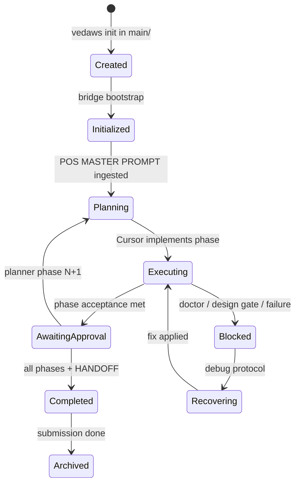

# Vespawd Architecture

**Status:** Design only — no implementation in this document.  
**Constraint:** `paws022/` and `vedaws/` are **frozen references**. Vespawd integrates them **without modifying either tree**. All new behavior lives under `main/`.  
**Prerequisite:** [PAWS_VS_VEDAWS_ANALYSIS.md](PAWS_VS_VEDAWS_ANALYSIS.md)  
**Date:** 2026-07-01  

---

## 1. What Vespawd is

**Vespawd** is a **hybrid Development Operating System** that keeps PAWS as the **human-facing agent workflow** (planner → executor → documenter) and adds Vedaws as the **executable orchestration runtime** underneath the application workspace.

Design thesis:

> **PAWS decides what humans and agents say. Vedaws decides what may run next. Cursor still writes the app.**

Neither frozen reference is changed. Integration is achieved by:

1. Preserving the **sidecar workspace layout** from PAWS (`paws022/` + `main/`).
2. Treating **`vedaws/`** as the pinned runtime distribution (installed editable from this path).
3. Adding a **bridge layer** in `main/` that translates POS conventions into Vedaws orchestration and keeps both views consistent.

```
┌─────────────────────────────────────────────────────────────────────────┐
│  Workspace root (open in Cursor)                                       │
├─────────────────────────────────────────────────────────────────────────┤
│  paws022/          Frozen PAWS kernel (prompts, rules, POS memory)      │
│  vedaws/           Frozen Vedaws runtime (read-only reference + pip -e) │
│  main/             Vespawd application + bridge + .vedaws/              │
└─────────────────────────────────────────────────────────────────────────┘
```

Sources: `paws022/docs/PROJECT_LAYOUT.md` (sidecar), `vedaws/design/007_PROJECT_MODEL.md` (`.vedaws/` authority), analysis §9–§13.

---

## 2. Design principles

| # | Principle | Rationale |
|---|-----------|-----------|
| 1 | **Do not fork PAWS or Vedaws** | Frozen trees remain comparable references; Vespawd evolves in `main/`. |
| 2 | **POS MASTER PROMPT stays the planner contract** | Proven intake format; external planners unchanged (`paws022/.ai/planner_prompt.md`). |
| 3 | **Cursor remains the implementation executor** | PAWS never had a code runtime; Vedaws workers supplement, not replace, IDE agents for `main/src/`. |
| 4 | **Vedaws state is orchestration authority** | Formal eligibility, dependencies, audit trail (`vedaws/design/006_STATE_MACHINE.md`). |
| 5 | **PAWS files stay human-legible** | Agents and students read `tasks/current_task.md`, not TOML (`paws022/.ai/executor_rules.md`). |
| 6 | **Bridge synchronizes; neither tree owns the other** | Avoid dual manual updates (analysis §14 Q6). |
| 7 | **Academic and IDE workflows preserved** | HANDOFF, documenter, `design/` gate (`paws022/docs/SUBMISSION_DOCUMENTATION.md`, `UI_DESIGN.md`). |

---

## 3. Responsibility split

### 3.1 What remains in PAWS (`paws022/`)

PAWS continues to own **agent contracts, role boundaries, and human-readable project memory locations**. These responsibilities are **not moved** to Vedaws:

| Responsibility | PAWS artifact | Why it stays |
|----------------|---------------|--------------|
| **Planner output format** | `.ai/planner_prompt.md`, Gem split files | External tools configured against these files (`docs/EXTERNAL_AGENTS_SETUP.md`). |
| **Executor read order & coding discipline** | `.ai/executor_rules.md`, `system_prompt.md`, `coding_rules.md`, `architecture_rules.md`, `debugging_protocol.md` | IDE-portable; no Python required to read rules. |
| **Documenter pipeline** | `.ai/documenter_prompt.md`, `docs/SUBMISSION_DOCUMENTATION.md` | Vedaws has no rubric-phased school report flow. |
| **UI design contract** | `design/`, `docs/UI_DESIGN.md`, `docs/STITCH_CURSOR.md` | Vedaws software plugin scaffolds `docs/` but not screen-spec gates (`vedaws/design/008_ARTIFACTS.md`). |
| **Optional UI designer role** | `.ai/ui_designer_prompt.md` | Unique to PAWS. |
| **POS layer model (kernel / memory / scheduler / userspace)** | `.ai/system_prompt.md`, `executor_rules.md` | Conceptual frame for agents; Vedaws uses different vocabulary (`002_CORE.md`). |
| **Project memory templates** | `docs/architecture.md`, `api_contracts.md`, `db_schema.md`, `decisions.md` | Canonical PAWS paths; bridge maps to Vedaws artifact layout where needed. |
| **HANDOFF for documenter** | `docs/HANDOFF_FOR_DOCUMENTER.md` | Factual submission bridge; executor auto-maintenance rule preserved. |
| **External agent follow-up messages** | `planner_followup_message.md`, `documenter_followup_message.md` | Phase 2+ UX unchanged. |
| **Toolchain neutrality docs** | `docs/TOOLCHAIN.md`, `docs/LAZY_WORKFLOW.md`, `docs/EXECUTOR_LOOP.md` | User-facing process documentation. |
| **Cursor rule hook** | `.cursor/rules/pos.mdc` | Points at `executor_rules.md`; extended by Vespawd addendum in `main/` (see §10). |
| **Raw intake** | `tasks/intake.md` | Pre-planner dump; no Vedaws equivalent. |

PAWS **kernel files are read, not rewritten**, during normal Vespawd work. Per-project memory under `paws022/docs/` and `paws022/.ai/project_context.md` **is written** by the executor as today.

### 3.2 What moves to Vedaws (`vedaws/` runtime, operating on `main/`)

Vedaws owns **executable orchestration** previously performed implicitly by the human or hoped-for executor compliance:

| Responsibility | Vedaws component | Replaces in PAWS |
|----------------|------------------|------------------|
| **Project lifecycle state** | `StateEngine`, `state.toml`, `transitions.jsonl` | Informal `tasks/status.md` fields as *authority* |
| **Workflow structure & task dependencies** | `WorkflowEngine`, `*.workflow.toml` | Implicit phase ordering in backlog only |
| **Task readiness & dispatch eligibility** | `eligibility.py`, workflow tracker | Manual "pull from backlog" |
| **Capability-based worker routing** | `WorkerDispatcher`, `WorkerRegistry` | No PAWS equivalent |
| **Automation on task/state events** | `AutomationEngine`, `.vedaws/automation.toml` | No PAWS equivalent |
| **Health / project diagnostics** | `vedaws doctor`, plugin health checks | No automated checks in PAWS |
| **Artifact presence verification** | `vedaws software artifacts` (software plugin) | Manual HANDOFF checklists only |
| **AI capability routing** | `AIService`, `[ai]` in `config.toml` | Ad-hoc model choice in chat |
| **Orchestration audit trail** | Event bus + `transitions.jsonl` + `workflow-progress.json` | `tasks/completed/` + progress log (supplemented, not removed) |
| **Git tool integration** | `git` plugin workers/commands | Not in PAWS |
| **Structured software lifecycle template** | `software` plugin workflow (`scope` → `handoff`) | Planner backlog phases (aligned, not replaced at prompt level) |

Vedaws operates on **`main/` as the project root** (where `.vedaws/` lives). It does **not** orchestrate inside `paws022/`.

### 3.3 Division diagram

```
                    HUMAN / EXTERNAL AGENTS
                              │
         ┌────────────────────┼────────────────────┐
         ▼                    ▼                    ▼
    Planner (PAWS)     UI designer (PAWS)    Documenter (PAWS)
         │                    │                    │
         ▼                    ▼                    ▼
  POS MASTER PROMPT      design/DESIGN.md    HANDOFF + rubric
         │                    │                    │
         └────────────┬───────┴────────────────────┘
                      ▼
              Cursor EXECUTOR (PAWS rules)
                      │
         ┌────────────┼────────────┐
         ▼            ▼            ▼
   paws022/       main/bridge    main/src/
   memory +       (sync +        userspace
   scheduler      invoke)
   (markdown)          │
                       ▼
                 vedaws CLI ──► .vedaws/ in main/
                 (runtime)     state, workflow,
                               dispatch, automation
```

---

## 4. Public interface

The **public interface** is what a Vespawd user actually interacts with. Vedaws internals are not part of it.

### 4.1 Primary interface (unchanged from PAWS UX)

| Surface | Role | Source |
|---------|------|--------|
| **External planner** | Produces `# POS MASTER PROMPT` | `paws022/.ai/planner_prompt.md` |
| **Cursor chat** | Paste Master Prompt; executor implements | `paws022/.ai/executor_rules.md` + `main/.cursor/rules/vespawd.mdc` (addendum) |
| **`paws022/tasks/current_task.md`** | "What am I doing now?" | Synced from bridge; human-readable |
| **`paws022/docs/HANDOFF_FOR_DOCUMENTER.md`** | Submission facts | Executor-maintained |
| **`paws022/design/DESIGN.md`** | UI spec gate | PAWS contract |
| **External documenter** | Phased report | `paws022/.ai/documenter_prompt.md` |
| **`main/src/`** | Application code | PAWS userspace (sidecar app path) |

### 4.2 Secondary interface (Vespawd additions — power user / diagnostics)

Thin Vedaws CLI, always targeting **`main/`** via `--path`:

| Command | User purpose | When shown |
|---------|--------------|------------|
| `vedaws status --path main` | Orchestration snapshot | After bridge sync; optional in HANDOFF footer |
| `vedaws doctor --path main` | "Is the project healthy?" | On setup, before run, when blocked |
| `vedaws run --path main` | Advance automated dispatch loop | After executor completes a phase; bridge may invoke |
| `vedaws software artifacts --path main` | Doc artifact checklist | Before handoff / documenter phase |
| `vedaws workflow show --path main` | Phase progress | When user asks "what's next?" |

Users are **not** expected to edit `.vedaws/*.toml` by hand in v1; the bridge and executor maintain them.

### 4.3 Non-interface (hidden)

See §8.

### 4.4 Public interface summary

> **Vespawd's public interface is still PAWS-shaped.** Vedaws exposes a small diagnostic CLI; it does not replace Cursor, the planner, or the documenter.

---

## 5. Project lifecycle

Vespawd lifecycle merges PAWS **phase loop** with Vedaws **state machine** and **software workflow**.

### 5.1 Lifecycle phases (user-visible)

| Phase | User action | PAWS artifacts | Vedaws state (typical) |
|-------|-------------|----------------|------------------------|
| **0. Bootstrap** | Create/open workspace | `project_context.md` filled | `created` → `initialized` |
| **1. Intake** | Paste assignment in `tasks/intake.md` | `intake.md` | — |
| **2. Plan** | Planner → Master Prompt | — (prompt in chat) | — |
| **3. Execute phase** | Cursor: "Execute this." + paste | `current_task.md`, memory docs, `src/` | `planning` → `executing` |
| **4. Verify** | Human runs/tests app | `status.md`, `completed/` log | task `completed`; may stay `executing` |
| **5. Advance** | Planner follow-up or bridge pull | next `current_task.md` | next workflow task `READY` |
| **6. UI design** (if needed) | UI designer → `design/DESIGN.md` | `design/` | optional; gate before UI tasks |
| **7. Handoff** | Executor finalizes HANDOFF | `HANDOFF_FOR_DOCUMENTER.md` | `software.handoff` task; `awaiting_approval` optional |
| **8. Document** | Documenter + rubric | — | `completed` when user accepts |
| **9. Archive** | Course submission done | `tasks/completed/` | `archived` (manual `vedaws state transition`) |

### 5.2 Vedaws state machine mapping

Canonical states from `vedaws/design/006_STATE_MACHINE.md`. Bridge maps PAWS scheduler signals:

| Vedaws state | Entered when | PAWS signal |
|--------------|--------------|-------------|
| `created` | `vedaws init` in `main/` | Bootstrap |
| `initialized` | Bridge completes first-time wiring | `project_context.md` has name + layout |
| `planning` | Master Prompt ingested; workflow activated | `current_task Status: in_progress` |
| `ready` | Preconditions met; no blockers | `vedaws doctor` clean |
| `executing` | Executor implementing in `main/src/` | Active implementation |
| `awaiting_approval` | Phase complete; human must test/approve | User testing between phases (`EXECUTOR_LOOP.md`) |
| `blocked` | Doctor failure, missing worker, design gate | `current_task Status: blocked` |
| `failed` | Task/workflow failure | Executor marks blocked + reason |
| `recovering` | User/fix loop after failure | Debugging per `debugging_protocol.md` |
| `completed` | All phases + handoff done | Documenter ready |
| `archived` | Post-submission | User-initiated |

### 5.3 Workflow alignment

Vespawd v1 activates the Vedaws **software** workflow (`vedaws/plugins/software/templates/project/workflows/software.workflow.toml`):

```
scope → architecture → api-design → implement → test → review → handoff
```

Planner **BACKLOG ITEMS** in POS MASTER PROMPT should name phases that **map 1:1** to these task ids where possible. The bridge maintains a **phase map** (design artifact, not code in this document):

| Vedaws task id | Typical POS CURRENT TASK theme |
|----------------|-------------------------------|
| `scope` | Requirements, MVP scope, context updates |
| `architecture` | Architecture doc, ADRs |
| `api-design` | `api_contracts.md`, schema design |
| `implement` | Feature code in `main/src/` |
| `test` | Tests, demo steps |
| `review` | Fix pass, lint, review |
| `handoff` | HANDOFF refresh, artifact checklist |

UI-heavy work spans `implement` with PAWS **`design/` gate** enforced by the executor before coding screens (`paws022/docs/UI_DESIGN.md`).

### 5.4 Lifecycle diagram



---

## 6. POS MASTER PROMPT → execution

This is the **central integration flow**. PAWS intake format is unchanged; the bridge adds Vedaws side effects.

### 6.1 Sequence

```
Planner                Cursor (executor)              Bridge (main/)           Vedaws
   │                          │                          │                      │
   │  POS MASTER PROMPT       │                          │                      │
   ├─────────────────────────►│                          │                      │
   │                          │ 1. Parse sections        │                      │
   │                          │    (executor_rules.md)   │                      │
   │                          ├─────────────────────────►│                      │
   │                          │                          │ 2. Ensure .vedaws/   │
   │                          │                          ├─────────────────────►│ init if missing
   │                          │                          │ 3. Map CURRENT TASK  │
   │                          │                          │    → workflow task   │
   │                          │                          ├─────────────────────►│ activate workflow
   │                          │                          │                        │ state transition
   │                          │◄─────────────────────────┤ 4. Return context:   │
   │                          │    eligibility, blockers │    active task id,   │
   │                          │                          │    doctor summary    │
   │                          │ 5. Write PAWS files      │                      │
   │                          │    current_task, context,│                      │
   │                          │    backlog, HANDOFF seed │                      │
   │                          │ 6. Implement main/src/   │                      │
   │                          │    per acceptance +      │                      │
   │                          │    design gate           │                      │
   │                          ├─────────────────────────►│ 7. Post-implement   │
   │                          │                          ├─────────────────────►│ run / complete task
   │                          │                          │                      │ automation fires
   │                          │ 8. Update HANDOFF,       │◄─────────────────────┤ events → sync PAWS
   │                          │    status.md, completed/ │                      │
```

### 6.2 Parser inputs (from PAWS)

Executor still parses (`paws022/.ai/executor_rules.md`):

- PROJECT BRIEF  
- PROJECT CONTEXT UPDATES → `paws022/.ai/project_context.md`  
- CURRENT TASK → `paws022/tasks/current_task.md`  
- BACKLOG ITEMS → `paws022/tasks/backlog.md`  
- EXECUTOR INSTRUCTIONS  

**Bridge extension (new):** after step 1, executor (or bridge script invoked by executor) passes structured extract to bridge:

| Master Prompt section | Bridge action | Vedaws effect |
|----------------------|---------------|---------------|
| PROJECT CONTEXT UPDATES | Sync `main/.vedaws/project.toml` name; ensure `software` template plugins enabled | `plugins.toml` |
| CURRENT TASK goal + criteria | Map to `software.<task_id>` via phase map | Mark workflow focus; transition toward `executing` |
| BACKLOG ITEMS | Store ordered phase list in bridge manifest | Pre-seed workflow expectations |
| UI in acceptance criteria | Set `design_gate: required` in bridge manifest | Block `implement` UI until `design/DESIGN.md` ready |
| EXECUTOR INSTRUCTIONS | Unchanged for code; append "run bridge post-phase" | — |

### 6.3 Execution modes per task type

Not every Vedaws task is fully automated. Vespawd v1 uses **three execution modes**:

| Mode | Vedaws role | Cursor role | Example tasks |
|------|-------------|-------------|---------------|
| **A. Agent-primary** | Track state, eligibility, artifacts | Write docs + code | `implement`, `architecture`, `api-design` |
| **B. Tool-assisted** | Dispatch plugin worker | Interpret output, continue | `git.status` after implement (automation rule in software plugin) |
| **C. Human gate** | `awaiting_approval` state | Wait for user test | Between planner phases |

`vedaws run` dispatches workers for READY tasks with matching capabilities. **Cursor remains the worker for implementation** — Vedaws does not write `main/src/` unless an AI worker is explicitly configured and chosen; default Vespawd design keeps **Cursor as the implementer** to preserve PAWS executor semantics.

### 6.4 Completion criteria

A Master Prompt phase is **orchestrationally complete** when:

1. PAWS acceptance criteria satisfied (`current_task.md` checkboxes).  
2. Bridge records Vedaws task outcome (`completed` or manual `vedaws tasks complete`).  
3. `vedaws doctor --path main` reports no blocking issues (or user acknowledges warnings).  
4. HANDOFF updated (`executor_rules.md` §Handoff automation).  
5. `tasks/status.md` refreshed by bridge from Vedaws snapshot.

---

## 7. Vedaws components hidden from the user

Users should not need to understand Vedaws architecture docs to use Vespawd. The following stay **internal**:

| Hidden component | Location | Why hidden |
|------------------|----------|------------|
| `RuntimeContext` / `bootstrap()` | `vedaws/runtime/vedaws/runtime/` | Per-command wiring; no direct interaction |
| `EventBus` publish/subscribe | `vedaws/runtime/vedaws/events/` | Synchronous telemetry; surfaced only as side effects |
| `WorkerDispatcher` / matcher | `vedaws/runtime/vedaws/dispatch/` | Capability matching is automatic |
| `PluginPlatform` lifecycle | `vedaws/runtime/vedaws/plugins/` | Plugins enabled at init; not user-toggled daily |
| `AIProviderRegistry` / router | `vedaws/runtime/vedaws/ai/` | Config-driven; no vendor picker in v1 UX |
| `AutomationEngine` depth limits | `vedaws/runtime/vedaws/automation/` | Rules run automatically |
| Worker manifests (`vedaws.worker.toml`) | `vedaws/workers/` | Discovery detail; plugins register workers |
| `transitions.jsonl` | `main/.vedaws/` | Audit log; optional `vedaws state history` |
| `workflow-progress.json` | `main/.vedaws/` | Reflected in `vedaws workflow show` |
| Plugin SDK / `VedawsPlugin` | `vedaws/plugins/*/` | Extension mechanism for future Vespawd plugin |
| Architect escalation | `vedaws/.ai/architect_escalation.md` | Maintainer-only |

**Surfaced lightly:** current project state name, active workflow task, doctor pass/fail, artifact checklist — via bridge-generated snippets in `tasks/status.md` or executor chat summary.

---

## 8. PAWS files: remain vs replaced

Paths relative to **`paws022/`** (POS sidecar). "Replaced" means **no longer authoritative alone**; file may still exist as a **projected view**.

### 8.1 Remain (unchanged role)

| Path | Role |
|------|------|
| `.ai/planner_prompt.md` (+ Gem splits) | Planner Instructions |
| `.ai/documenter_prompt.md` (+ followups) | Documenter Instructions |
| `.ai/ui_designer_prompt.md` | Optional UI designer |
| `.ai/system_prompt.md` | Layer model |
| `.ai/executor_rules.md` | Executor behavior (extended by reference to bridge) |
| `.ai/architecture_rules.md` | Code layering |
| `.ai/coding_rules.md` | Code standards |
| `.ai/debugging_protocol.md` | Defect process |
| `.ai/workflow.md` | Task lifecycle narrative |
| `.ai/project_context.md` | Product memory |
| `docs/architecture.md` | Architecture memory |
| `docs/api_contracts.md` | API memory |
| `docs/db_schema.md` | Schema memory |
| `docs/decisions.md` | ADRs |
| `docs/HANDOFF_FOR_DOCUMENTER.md` | Documenter input |
| `docs/UI_DESIGN.md` | UI contract |
| `docs/STITCH_CURSOR.md` | Stitch guide |
| `docs/SUBMISSION_DOCUMENTATION.md` | Report flow |
| `docs/LAZY_WORKFLOW.md` | Pipeline docs (updated in `main/docs/` only) |
| `docs/TOOLCHAIN.md` | Role matrix |
| `docs/EXTERNAL_AGENTS_SETUP.md` | External agent setup |
| `docs/EXECUTOR_LOOP.md` | Phase loop |
| `docs/ADOPT_*.md` | Adoption (Vespawd adds parallel bootstrap doc in `main/`) |
| `design/**` | UI artifacts |
| `tasks/intake.md` | Raw intake |
| `tasks/backlog.md` | Planner queue (planner still writes here) |
| `tasks/completed/**` | Historical log |
| `AGENTS.md` | Agent entry |
| `.cursor/rules/pos.mdc` | Cursor POS rule |

### 8.2 Replaced as authority (kept as synchronized projections)

| Path | Was | Becomes |
|------|-----|---------|
| `tasks/current_task.md` | Sole scheduler truth | **Projection** of active Vedaws task + Master Prompt criteria; bridge writes after ingest |
| `tasks/status.md` | Manual phase snapshot | **Projection** of `vedaws status` + HANDOFF freshness + design gate |
| — | — | **Authoritative orchestration** moves to `main/.vedaws/state.toml` + `workflow-progress.json` |

### 8.3 Supplemented (dual layout for docs)

Vedaws software template scaffolds **directory-style** docs under `main/` (`vedaws/design/008_ARTIFACTS.md`):

| PAWS memory file (`paws022/docs/`) | Vedaws artifact (`main/docs/`) | Resolution |
|-----------------------------------|-------------------------------|------------|
| `architecture.md` | `architecture/ARCHITECTURE.md` | **Bridge mirrors** content both ways or designates `main/docs/architecture/` canonical for app, `paws022/docs/architecture.md` as agent summary |
| `api_contracts.md` | `api/API.md` | Same pattern |
| `decisions.md` | `decisions/DECISIONS.md` | Same pattern |
| `HANDOFF_FOR_DOCUMENTER.md` | `handoff/HANDOFF.md` | **PAWS HANDOFF remains documenter-facing**; bridge copies facts to Vedaws artifact path for `vedaws software artifacts` |

Vespawd design choice: **documenter reads `paws022/docs/HANDOFF_FOR_DOCUMENTER.md` only** (preserve academic workflow). Vedaws artifact path is for orchestration checks.

### 8.4 Not used from PAWS template

| Path | Reason |
|------|--------|
| `paws022/src/` | Userspace is `main/src/` in sidecar layout |
| Referenced missing scripts (`scripts/pos-*.ps1`) | Vespawd bootstrap documented in `main/docs/`; optional thin wrappers in `main/` only |

---

## 9. Bridge layer (new, in `main/`)

The **bridge** is the only new architectural component required. It does not exist in either frozen tree.

### 9.1 Purpose

1. **Translate** POS MASTER PROMPT sections → Vedaws workflow/state updates.  
2. **Synchronize** PAWS scheduler projections ↔ `.vedaws/` progress.  
3. **Invoke** Vedaws CLI subprocesses against `main/` (never modify `vedaws/` source).  
4. **Enforce gates** — design-before-code, doctor before handoff.  
5. **Emit** human-readable summaries for Cursor and `tasks/status.md`.

### 9.2 Planned location (design)

```
main/
├── .vedaws/                 # Vedaws project root (orchestration authority)
├── src/                     # PAWS userspace (application)
├── docs/                    # App docs + Vespawd docs (this file)
├── design/                  # Optional: app UI specs (or symlink policy to paws022/design)
├── bridge/
│   ├── manifest.toml        # Phase map, layout pointers, bridge version
│   ├── sync/                # PAWS ↔ Vedaws projection logic (future)
│   └── hooks/               # post-master-prompt, post-implement, pre-handoff
└── .cursor/rules/
    └── vespawd.mdc          # Addendum: invoke bridge, --path main
```

`paws022/` paths are **read/written by executor** per PAWS rules; bridge config in `main/bridge/manifest.toml` holds **pointers**:

```toml
# Illustrative manifest shape — design only, not implemented
[vespawd]
version = "0.1.0"
layout = "sidecar"

[pos]
root = "../paws022"
current_task = "tasks/current_task.md"
handoff = "docs/HANDOFF_FOR_DOCUMENTER.md"
design_gate = "../paws022/design/DESIGN.md"

[vedaws]
project_root = "."          # main/
workflow_id = "software"
cli = "../vedaws"           # editable install path in monorepo
```

### 9.3 Bridge operations (conceptual API)

| Operation | Trigger | Effects |
|-----------|---------|---------|
| `bootstrap` | First open / `vedaws init` | Create `.vedaws/`, activate software workflow, sync initialized state |
| `ingest_master_prompt` | Executor parses Master Prompt | Update PAWS files + map phase + Vedaws transition |
| `pre_implement_check` | Before `main/src/` edits | Design gate, doctor, state eligibility |
| `post_phase_complete` | Acceptance criteria met | Complete Vedaws task, run automation, refresh HANDOFF |
| `sync_status` | Any time | Write `tasks/status.md` from `vedaws status` |
| `pre_documenter` | Handoff phase | Artifact checklist, mark handoff task complete |

### 9.4 Why a bridge instead of a Vedaws plugin?

`vedaws/design/010_PLUGINS.md` requires plugins to extend Vedaws without modifying core — a **Vespawd plugin** is the long-term home. For v1 design:

- **Cannot modify** `vedaws/plugins/` in frozen tree.  
- Bridge in `main/` works immediately with subprocess CLI.  
- Future: optional `vespawd` Vedaws plugin installed from `main/` that wraps the same logic.

---

## 10. Data flows: Planner → Cursor → Vedaws

### 10.1 Artifacts flowing

```
┌──────────────┐     POS MASTER PROMPT      ┌──────────────┐
│   Planner    │ ─────────────────────────► │    Cursor    │
│  (external)  │     (markdown in chat)     │  (executor)  │
└──────────────┘                            └──────┬───────┘
                                                   │
                    ┌──────────────────────────────┼──────────────────────────────┐
                    ▼                              ▼                              ▼
           paws022/tasks/                  paws022/.ai/                    main/src/
           current_task.md                 project_context.md              (code)
           backlog.md                      paws022/docs/*
           status.md (synced)
           HANDOFF_FOR_DOCUMENTER.md
                    │                              │
                    └──────────────┬───────────────┘
                                   ▼
                          main/bridge (ingest/sync)
                                   │
                    ┌──────────────┼──────────────┐
                    ▼              ▼              ▼
            main/.vedaws/   vedaws CLI     main/docs/
            state.toml      subprocess     artifacts
            workflow-progress.json
            automation.toml
```

### 10.2 Data element matrix

| Data | Origin | Consumed by | Store |
|------|--------|-------------|-------|
| Assignment text | User | Planner | `tasks/intake.md` |
| Phase plan | Planner | Executor, bridge | Master Prompt → `backlog.md` + bridge manifest |
| Stack/constraints | Planner | Executor | `project_context.md` |
| Acceptance criteria | Planner | Executor, Vedaws task | `current_task.md` + workflow task metadata |
| Architecture/API/schema | Executor | Documenter, Vedaws artifacts | `paws022/docs/*` + `main/docs/*` |
| UI spec | UI designer / executor | Executor | `paws022/design/` |
| Implementation | Executor | User testing | `main/src/` |
| Orchestration state | Vedaws | Bridge → status projection | `main/.vedaws/state.toml` |
| Task progress | Vedaws | Bridge, `vedaws workflow show` | `workflow-progress.json` |
| HANDOFF facts | Executor | Documenter | `paws022/docs/HANDOFF_FOR_DOCUMENTER.md` |
| Report prose | Documenter | Submission | External (Canvas/Docs) |
| Git/worker results | Vedaws git plugin | Executor (optional) | Chat + events only |

### 10.3 Control flow vs data flow

- **Control:** Vedaws decides **eligibility** (what task may be active, whether run proceeds).  
- **Data:** PAWS markdown remains **what agents read** for context.  
- **Cursor** is the only component that **writes application code**.

---

## 11. User experience vs current PAWS

### 11.1 What feels the same

| Aspect | Unchanged |
|--------|-----------|
| Planner still outputs `# POS MASTER PROMPT` only | ✓ |
| User still pastes into Cursor with "Execute this." | ✓ |
| Executor still follows `executor_rules.md` read order | ✓ |
| `design/` gate before new UI | ✓ |
| HANDOFF + documenter last with rubric | ✓ |
| Sidecar: POS files in `paws022/`, app in `main/` | ✓ |
| No requirement to learn Vedaws design docs | ✓ |

### 11.2 What improves (user-visible)

| Today (PAWS alone) | Vespawd |
|--------------------|---------|
| User manually knows when a phase is "done" | Bridge + `vedaws software artifacts` checklist |
| `tasks/status.md` often stale | Auto-synced from `vedaws status` |
| No automated health check | `vedaws doctor` surfaced on block |
| Phase order advisory only | Workflow `depends_on` enforced |
| Backlog pull is manual | Next READY task visible in status projection |
| Git status after implement is manual | Software plugin automation can run `git.status` (`vedaws/design/005_AUTOMATION.md`) |

### 11.3 What is new (light friction)

| Addition | User impact |
|----------|-------------|
| One-time `vedaws init` / bridge bootstrap in `main/` | Setup step; can be triggered by executor on first Master Prompt |
| `main/.vedaws/` directory | Visible in repo; users told "do not edit by hand" |
| Occasional `vedaws doctor` output in chat | When blocked or at handoff |
| Python 3.11+ required for orchestration | PAWS alone did not need Python in frozen copy |

### 11.4 What is explicitly not changing

- External planner/documenter configuration (`EXTERNAL_AGENTS_SETUP.md`).  
- POS MASTER PROMPT section headings.  
- Executor does not commit/push unless asked (`coding_rules.md`).  
- Documenter never sees Vedaws CLI output directly — only HANDOFF facts.

---

## 12. Vespawd workspace layout (canonical)

```
vespawd/                          ← workspace root (open in Cursor)
├── paws022/                      ← PAWS kernel + POS memory (frozen reference)
│   ├── .ai/
│   ├── tasks/
│   ├── docs/
│   └── design/
├── vedaws/                       ← Vedaws runtime (frozen reference, pip install -e)
│   ├── runtime/
│   ├── plugins/
│   └── design/
└── main/                         ← Vespawd application + bridge + .vedaws/
    ├── bridge/
    ├── .vedaws/
    ├── src/
    ├── docs/                     ← includes VESPAWD_ARCHITECTURE.md
    └── .cursor/rules/vespawd.mdc
```

**Git publishing** (per `paws022/docs/PROJECT_LAYOUT.md`): initialize git in **`main/`** for app publication; `paws022/` and `vedaws/` may stay local references or separate remotes. Vespawd docs live with the app.

---

## 13. Plugins in scope (Vespawd v1)

From frozen Vedaws tree, v1 design **enables** in `main/.vedaws/plugins.toml`:

| Plugin | Use in Vespawd |
|--------|----------------|
| **software** | Workflow, skills, artifacts, automation |
| **git** | Post-implement status; optional commit flow |
| **mock-ai** | CI/dev without vendor keys |
| **unity** | Out of scope unless project template explicitly chosen |

**Not in v1:** Custom Vedaws plugin inside frozen `vedaws/plugins/` — future `main/plugins/vespawd/` if needed.

---

## 14. Resolved analysis questions

Decisions implied by this architecture (from [PAWS_VS_VEDAWS_ANALYSIS.md](PAWS_VS_VEDAWS_ANALYSIS.md) §14):

| # | Question | Vespawd decision |
|---|----------|------------------|
| 1 | Coursework OS vs DevOS vs merge? | **Deliberate merge** — PAWS UX + Vedaws orchestration |
| 2 | Python required? | **Yes**, for orchestration only; agents still markdown-driven |
| 3 | Sidecar layout? | **Yes** — `paws022/` + `main/` + `vedaws/` reference |
| 4 | File vs runtime enforcement? | **Hybrid** — Vedaws authoritative; PAWS projected |
| 5 | Master Prompt vs workflow TOML? | **Master Prompt for humans; workflow TOML for machine** |
| 6 | Authoritative state? | **`main/.vedaws/state.toml`**; PAWS tasks synced |
| 7 | Distinct roles? | **Yes** — planner/documenter external; Cursor executes |
| 8 | Prompt location? | **Stays in `paws022/.ai/`** |
| 9 | Documenter pipeline? | **First-class** |
| 10 | `design/` + Vedaws artifacts? | **Both** — bridge mirrors doc content |
| 11 | UI tools? | **Executor-side MCP** unchanged (Stitch) |
| 12 | Plugins? | **software + git + mock-ai** default |
| 13 | POS plugin? | **Bridge first**; plugin later from `main/` |
| 14 | Memory deferred? | **Accept file-backed** until Vedaws `009_MEMORY.md` ships |
| 15 | project_context vs project.toml? | **Bridge syncs name/layout**; each keeps its fields |
| 16 | Security? | **Inherited trust-all model**; document in `main/docs/` |
| 17 | Sync orchestration sufficient? | **Yes for v1** single developer / coursework |
| 18 | Git in `main/`? | **Yes** |
| 19 | Update story? | **Independent** — POS `instructionsVersion` vs Vedaws semver; bridge declares compatible pair |
| 20 | Ready definition? | **doctor pass + HANDOFF fresh + design gate + artifacts** |
| 21 | Test strategy? | **Vedaws integration tests for bridge**; PAWS compliance via checklist |

---

## 15. Out of scope (this design)

- Modifying `paws022/` or `vedaws/` source.  
- Implementing bridge code (future work in `main/bridge/`).  
- Vendor AI plugins (Claude/OpenAI/Gemini placeholders only in `vedaws/workers/ai/`).  
- Vedaws memory system (`vedaws/design/009_MEMORY.md` — deferred).  
- Distributed/async orchestration (v2 per Vedaws roadmap).  
- Replacing Cursor with `vedaws run` for all implementation.

---

## 16. Implementation order (guidance only)

When implementation begins — **in `main/` only**:

1. Document bridge manifest schema and phase map.  
2. `vedaws init --template software` in `main/`.  
3. Bridge: `ingest_master_prompt` → PAWS file writes + state transition.  
4. Cursor addendum rule `vespawd.mdc`.  
5. Bridge: `sync_status`, `post_phase_complete`.  
6. HANDOFF ↔ artifact mirror.  
7. Integration tests invoking real `vedaws` CLI against fixture workspace.

---

## 17. Key citations

| Topic | File |
|-------|------|
| PAWS layers & Master Prompt | `paws022/.ai/executor_rules.md` |
| PAWS sidecar layout | `paws022/docs/PROJECT_LAYOUT.md` |
| PAWS pipeline | `paws022/docs/LAZY_WORKFLOW.md` |
| Vedaws project model | `vedaws/design/007_PROJECT_MODEL.md` |
| Vedaws state machine | `vedaws/design/006_STATE_MACHINE.md` |
| Software workflow | `vedaws/plugins/software/templates/project/workflows/software.workflow.toml` |
| Vedaws automation | `vedaws/design/005_AUTOMATION.md` |
| Comparison & gaps | `main/docs/PAWS_VS_VEDAWS_ANALYSIS.md` |

---

*Design document only. No changes to `paws022/` or `vedaws/`.*
