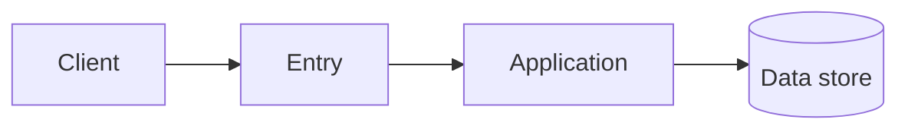

# Architecture (POS Memory)

> **Per-project.** Replace all placeholders after bootstrap. Agents read this before structural changes to `src/`.

## Overview

_{What the system does and who it serves—2–4 sentences.}_

## Components

| Component | Location in `src/` | Responsibility |
|-----------|-------------------|----------------|
| | | |

## Data Flow

Rename nodes to match your stack. Delete the diagram if not useful for this project.

## Dependencies

- **External:** _{APIs, SaaS, message brokers}_
- **Internal modules:** _{how packages or folders relate}_

## Cross-Cutting

- Auth:
- Logging / metrics:
- Configuration:

## POS Links

- Contracts: [api_contracts.md](api_contracts.md)
- Schema: [db_schema.md](db_schema.md)
- Decisions: [decisions.md](decisions.md)
- Kernel rules: [../.ai/architecture_rules.md](../.ai/architecture_rules.md)
