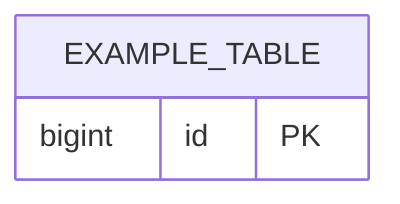

# Database Schema (POS Memory)

> **Per-project.** Canonical schema reference for agents and developers. Set engine in the header table during bootstrap.

## Engine & Conventions

| Item | Value |
|------|--------|
| Engine | _{e.g. MySQL 8}_ |
| Migration tool | |
| Naming | _{e.g. snake_case tables}_ |
| PK strategy | _{e.g. BIGINT AUTO_INCREMENT}_ |
| Timestamps | _{e.g. `created_at`, `updated_at` UTC}_ |

## Tables

_Delete the example table when you define real schema._

### `example_table` _(template only)_

| Column | Type | Nullable | Notes |
|--------|------|----------|-------|
| id | BIGINT UNSIGNED | NO | PK |
| created_at | DATETIME | NO | |

**Indexes:** PRIMARY KEY (`id`)

## Relationships

_{ER notes or diagram}_

## Migrations Log

| Date | Description | Artifact |
|------|-------------|----------|
| | | |
