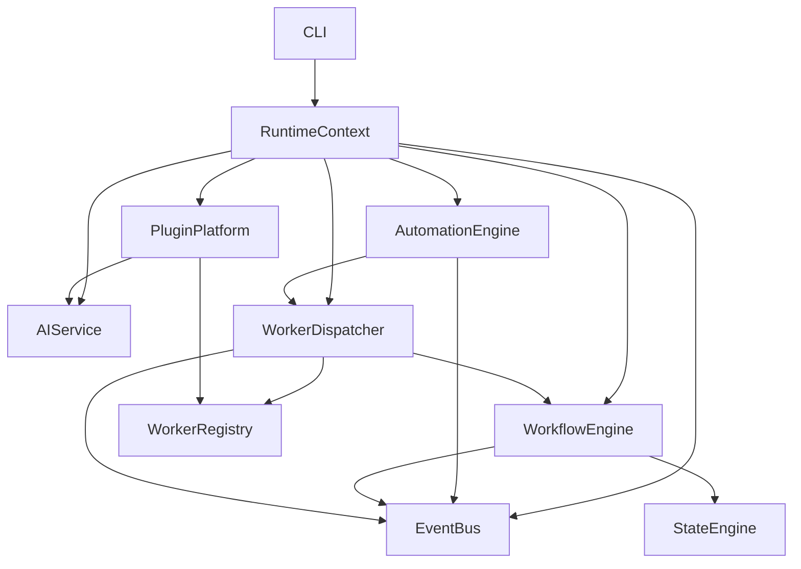

# Vedaws Architecture Freeze — v0.5

**Freeze phase:** Architecture Freeze documentation sprint — **complete**  
**Architecture version:** 0.5.0  
**Implementation baseline:** Milestones 6–12  
**Source audit:** [`ARCHITECTURE_REVIEW_V0.5.md`](ARCHITECTURE_REVIEW_V0.5.md)  
**Public API contract:** [`API_STABILITY.md`](API_STABILITY.md)  
**Design index:** [`design/README.md`](../design/README.md)

---

## What this document is

This document **declares the v0.5 architecture frozen**. It records architectural decisions that are implemented through Milestone 12 and must not change without an explicit architecture review.

This freeze is **not** a v1 product release. Vedaws remains a credible Development OS kernel with known deferrals (skills execution, security hardening, AI worker binding, and others documented below).

No runtime code, plugins, or tests were modified to produce this freeze declaration.

---

## Scope of the freeze

### In scope (frozen)

- Orchestration model: runtime bootstrap, state machine, workflows, dispatch, events, automation, and AI provider routing
- Extension model: plugin platform, contribution SDK, and on-disk project layout under `.vedaws/`
- Execution contract: worker capability matching and `TaskDispatch` → `TaskOutcome`
- Domain neutrality: domain logic lives in plugins only

### Out of scope (explicitly not frozen as product-ready)

- Production security and trust boundaries (`design/013_SECURITY.md` — Draft, known limitations documented)
- Memory system (`design/009_MEMORY.md` — **Deferred**, out of v0.5 scope; no runtime implementation)
- AI worker execution binding (providers exist; dispatch path does not use `AIService` yet)
- Skills execution layer (metadata registration only)
- Plugin configuration schema merge (`contribute_configuration` registered but not merged)
- Package version alignment (`0.1.0` in `runtime/vedaws/__init__.py` at review time — see [Version alignment](#version-alignment))

---

## Frozen architectural decisions

These decisions are implemented and validated through M12. They must not be redesigned without architecture review.

| Decision | Rationale | Primary design reference |
|----------|-----------|--------------------------|
| Plugin-only domain logic | Core value proposition | [`design/010_PLUGINS.md`](../design/010_PLUGINS.md) |
| `.vedaws/` project authority | Ecosystem lock-in point | [`design/007_PROJECT_MODEL.md`](../design/007_PROJECT_MODEL.md) |
| `state.toml` as authoritative state | Implemented and documented | [`design/006_STATE_MACHINE.md`](../design/006_STATE_MACHINE.md) |
| Worker capability matching (not type matching) | Extensibility | [`design/004_WORKERS.md`](../design/004_WORKERS.md) |
| `TaskDispatch` / `TaskOutcome` execution contract | All workers depend on it | [`design/004_WORKERS.md`](../design/004_WORKERS.md) |
| `VedawsPlugin` + `PluginContext` contribution model | All first-party plugins use it | [`design/010_PLUGINS.md`](../design/010_PLUGINS.md) |
| `AIProvider` + capability routing (no vendor imports in core) | Strategic invariant | [`design/017_AI_PROVIDERS.md`](../design/017_AI_PROVIDERS.md) |
| Event-driven automation (not hardcoded hooks) | M11 validation | [`design/005_AUTOMATION.md`](../design/005_AUTOMATION.md) |
| Generic project template discovery | M9/M10 validation | [`design/007_PROJECT_MODEL.md`](../design/007_PROJECT_MODEL.md) |
| Synchronous event bus semantics (for now) | Changing async is v2-scale | [`design/003_RUNTIME.md`](../design/003_RUNTIME.md) |

---

## Implemented baseline (Milestones 6–12)

| Milestone | Deliverable | Design reference |
|-----------|-------------|------------------|
| M6 | Plugin platform (discovery, lifecycle, SDK, Git plugin) | [`design/010_PLUGINS.md`](../design/010_PLUGINS.md) |
| M7 | Event bus (in-process, synchronous) | [`design/003_RUNTIME.md`](../design/003_RUNTIME.md) |
| M8 | Event integration across workflow, dispatch, plugins | [`design/003_RUNTIME.md`](../design/003_RUNTIME.md) |
| M9 | Software domain plugin (template, workflow, workers) | [`design/008_ARTIFACTS.md`](../design/008_ARTIFACTS.md) |
| M10 | Unity domain plugin (second domain proof) | [`design/008_ARTIFACTS.md`](../design/008_ARTIFACTS.md) |
| M11 | Automation engine (rules, CLI, doctor) | [`design/005_AUTOMATION.md`](../design/005_AUTOMATION.md) |
| M12 | AI provider SDK (`AIService`, routing, mock-ai) | [`design/017_AI_PROVIDERS.md`](../design/017_AI_PROVIDERS.md) |

**Integration evidence:** 107 tests at architecture review time ([`ARCHITECTURE_REVIEW_V0.5.md`](ARCHITECTURE_REVIEW_V0.5.md) §Test coverage summary).

**End-to-end path validated:** `init` → state → workflow → dispatch → events → automation → `doctor`.

---

## Architecture layer (as implemented)

Bootstrap order: config → logging → EventBus → workers → PluginPlatform → project detection → WorkerDispatcher → AIService → AutomationEngine → `RuntimeContext`. See [`design/003_RUNTIME.md`](../design/003_RUNTIME.md) and review §1 Runtime.

---

## Explicit deferrals (not part of v0.5 freeze contract)

These surfaces exist in code or SDK but are **intentionally incomplete**. They are documented as deferred, not as missing bugs.

| Surface | Current behavior | Post-freeze direction (from review) |
|---------|------------------|-------------------------------------|
| `contribute_skill()` | Metadata registered; no execution binding | M16: implement binding or remove API |
| `contribute_configuration()` | Schema registered; not merged into `load_config()` | M16: merge or defer API |
| `AIService` in worker dispatch | Providers routable; workers do not call AI | M13: AI worker binding |
| `AIProvider.stream()` / `embeddings()` | Optional stubs; platform-wide not production-ready | Vendor plugins + async consumption |
| Automation `invoke_ai` action | Not implemented | Future plugin-local or new action type |
| Plugin sandbox / permissions | Plugins run as trusted local code | M14: security & trust |
| Memory system | Deferred per `009_MEMORY.md`; no runtime APIs | After M13 AI worker binding |
| Distributed / async orchestration | Synchronous in-process only | M15: orchestration hardening |
| `.vedaws/` schema versioning | No migration framework | P2 before v1 |
| Event payload schemas | Informal dicts | P2 typed contracts |

See [`API_STABILITY.md`](API_STABILITY.md) §Unstable and deferred APIs for contributor-facing detail.

---

## Known limitations at freeze

Documented in [`ARCHITECTURE_REVIEW_V0.5.md`](ARCHITECTURE_REVIEW_V0.5.md) §Biggest risks. Summary:

1. **Synchronous orchestration ceiling** — event bus, dispatcher, and automation share one thread; unsuitable for long AI latency without future job model.
2. **String-based cross-plugin contracts** — automation references worker ids (e.g. `git.status`) without manifest-level dependency declaration.
3. **Security vacuum** — no sandbox; plugins may run subprocesses (Git plugin).
4. **Dual state sources** — `project.toml` mirrors `state.toml`; `detect_project()` may write on read.
5. **Version alignment** — design documents harmonized at **0.5.0**; package version was aligned in post-freeze release engineering (see [Version alignment](#version-alignment)).
6. **Ghost APIs** — skills and plugin config registration without functional merge.

---

## Version alignment

| Artifact | At review | Architecture freeze label |
|----------|-----------|---------------------------|
| Architecture version | — | **0.5.0** |
| Python package (`runtime/vedaws/__init__.py`) | `0.1.0` | **Aligned to `0.5.0`** in post-freeze release update |
| Design documents | Mixed versions/statuses | **0.5.0** — harmonized (Architecture Freeze sprint complete) |

The architecture freeze is declared on **design and API contracts**, not on PyPI version bumps alone.

---

## Document map

| Document | Role at v0.5 freeze |
|----------|---------------------|
| [`design/README.md`](../design/README.md) | Canonical architecture index |
| [`design/000_VISION.md`](../design/000_VISION.md) through [`design/017_AI_PROVIDERS.md`](../design/017_AI_PROVIDERS.md) | Concept specifications |
| [`docs/ARCHITECTURE_REVIEW_V0.5.md`](ARCHITECTURE_REVIEW_V0.5.md) | Audit source (no code changes) |
| [`docs/API_STABILITY.md`](API_STABILITY.md) | Frozen public API inventory |
| [`docs/MILESTONE_6_SUMMARY.md`](MILESTONE_6_SUMMARY.md) … [`docs/MILESTONE_12_SUMMARY.md`](MILESTONE_12_SUMMARY.md) | Historical implementation records (M6–M12) |

**Architecture Freeze documentation sprint (complete):** All design documents updated — stubs filled (`009`, `013`–`016`), index and readme aligned (`design/README.md`, `VEDAWS_BOOTSTRAP.md`), headers and M12 content harmonized, version **0.5.0** across `design/`. See [`design/016_IMPLEMENTATION_PLAN.md`](../design/016_IMPLEMENTATION_PLAN.md) §v0.5 freeze gate.

---

## Post-freeze change policy

Before changing any **frozen decision** in the table above:

1. Read [`design/README.md`](../design/README.md) and the relevant design document.
2. Consult [`.ai/architect_escalation.md`](../.ai/architect_escalation.md) — if any escalation rule applies, stop and request architecture review.
3. Update the design document in the **same change** as any intentional implementation drift.
4. Update [`API_STABILITY.md`](API_STABILITY.md) if public contracts change.
5. Do **not** add domain logic to `runtime/vedaws/` — extend via plugins.

Proposed work toward v1 (from review; not part of this freeze’s scope):

| Priority | Item |
|----------|------|
| P0 | AI worker binding, security model, package version alignment |
| P1 | Skills/config ghost APIs, doctor tests, read-only project detection, dispatch/job model |
| P2 | Event payload schemas, `.vedaws/` versioning, artifact registry, promote draft design docs |

Review recommendation: do **not** add more domain plugins before AI worker binding (M13).

---

## Freeze declaration

**Vedaws architecture v0.5 is frozen** as of this document: the orchestration spine (runtime, plugins, events, automation, AI routing) and extension model described above are the authoritative baseline for all post-M12 work.

Product readiness for v1 requires the P0/P1 improvements listed in [`ARCHITECTURE_REVIEW_V0.5.md`](ARCHITECTURE_REVIEW_V0.5.md) §Things that MUST be improved before v1 — those are **roadmap items**, not retroactive changes to this freeze.

**Freeze status:** Active  
**Documentation sprint:** Complete (Sections A–F)  
**Release tag:** Package version aligned to `0.5.0` (post-freeze release engineering update)
