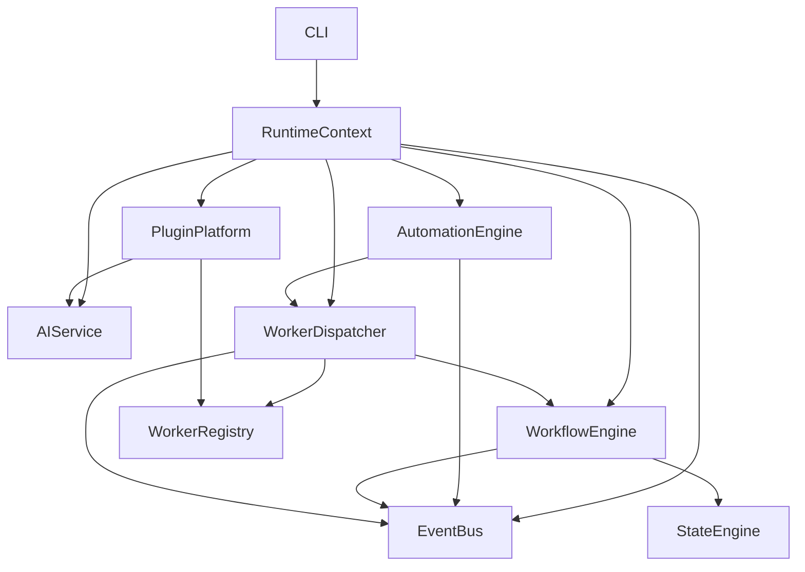

# Vedaws Core Architecture Review (v0.5)

**Date:** June 2026  
**Type:** Design audit (no implementation milestone)  
**Scope:** Repository-wide review through Milestone 12  
**Package version:** `0.1.0` (runtime)  
**Design baseline:** `design/` through M12 (plugins v0.5.0, automation, AI providers)

---

## Executive Summary

Vedaws has achieved its stated v0.5 goal: a **domain-neutral Development Operating System** with a coherent orchestration stack, a real plugin platform, and two independent domain proofs (software + Unity). The architecture is **intentionally layered**, **design-documented**, and **integration-tested** (107 tests).

The system is **not v1-ready**. Deferred surfaces (skills binding, plugin config merge, security, memory, real AI workers) are visible in code and docs. The biggest architectural win is keeping domain logic out of the runtime; the biggest risk is scaling synchronous orchestration and string-based cross-plugin coupling without stronger contracts.

| Metric | Score |
|--------|-------|
| **Overall architecture** | **7.8 / 10** |
| Design ↔ implementation alignment | 8.0 / 10 |
| Extension model (plugins) | 8.5 / 10 |
| Operational maturity (doctor, CLI) | 7.5 / 10 |
| Test depth | 7.0 / 10 |
| v1 production readiness | 5.5 / 10 |

---

## Review Methodology

Each subsystem was evaluated against:

1. Stated purpose in `design/`
2. Implementation in `runtime/vedaws/` and `plugins/`
3. Public vs internal API boundaries
4. Test coverage in `tests/`
5. Cross-subsystem coupling
6. Fit for the v0.5 “DevOS, not framework” thesis

No code was modified during this review.

---

## Subsystem Reviews

---

### 1. Runtime

#### 1. Purpose
Single composition root and session object for all orchestration. Answers: *what is loaded, what is active, what can run right now?*

#### 2. Current architecture
`bootstrap()` in `runtime/vedaws/runtime/bootstrap.py` wires config → logging → EventBus → workers → PluginPlatform → project detection → WorkerDispatcher → AIService → AutomationEngine → `RuntimeContext`. `shutdown()` reverses plugin and automation subscriptions.

#### 3. Strengths
- Clear single entry point; predictable initialization order
- `RuntimeContext` is a stable façade for CLI, doctor, and tests
- Explicit `RuntimeStatus` lifecycle (ACTIVE / STOPPING / INACTIVE)

#### 4. Weaknesses
- No dependency injection — every consumer gets full bootstrap cost
- Reads private field `plugin_platform._activation_errors`
- Hard to test subsystems in isolation without mocking entire workspace

#### 5. Technical debt
- Hub coupling at bootstrap (imports ~15 packages)
- Package `__version__` (`0.1.0`) lags design doc versioning (`0.5.0`)

#### 6. Potential simplifications
- Extract `_build_automation_engine` and AI wiring into a single `wire_orchestration()` helper with documented ordering
- Expose activation errors through a public `PluginPlatformResult` accessor instead of private fields

#### 7. Public APIs to freeze
- `bootstrap(workspace, *, quiet=False) -> RuntimeContext`
- `shutdown(context) -> None`
- `RuntimeContext` field names: `config`, `registry`, `worker_registry`, `project`, `dispatcher`, `event_bus`, `ai_service`, `automation_engine`

#### 8. Internal APIs to keep private
- `_build_automation_engine`
- `PluginPlatform._activation_errors`
- Any direct `sys.path` manipulation in plugin loader (plugin concern)

#### 9. Future scalability concerns
- Full bootstrap per CLI invocation — acceptable locally, costly for daemon/IDE embedding
- No runtime plugin hot-reload; restart required for contribution changes

#### 10. Overall score: **8.0 / 10**

---

### 2. CLI

#### 1. Purpose
Human-facing control plane: init projects, inspect state, run workflows, manage plugins, automation, and AI providers.

#### 2. Current architecture
`cli/app.py` → `commands.register_commands()` + `automation_commands` + `ai_commands` + dynamic `plugin_commands`. Each command bootstraps runtime (quiet or verbose) and delegates to reporters.

#### 3. Strengths
- Thin commands over runtime — no business logic duplication
- Plugin CLI dispatch is generic (`plugin_commands.py`) — no domain hardcoding
- Good smoke coverage in `test_cli.py` (12 tests)

#### 4. Weaknesses
- `commands.py` is a large god-module (~600+ LOC)
- Hello plugin registers `vedaws hello` **without a handler** — reference plugin incomplete
- No shared argparse parent for common flags beyond ad-hoc parsers

#### 5. Technical debt
- Command registration spread across four modules
- Plugin command argument registration is manual per command name in `_add_command_arguments`

#### 6. Potential simplifications
- Split `commands.py` by domain: `project_commands`, `workflow_commands`, `plugin_mgmt_commands`
- Auto-discover plugin CLI flags from handler signatures or manifest metadata

#### 7. Public APIs to freeze
- `vedaws.cli.app:main` entry point
- Command names and core flags: `init`, `status`, `doctor`, `state`, `workflow`, `tasks`, `run`, `plugins`, `events`, `automation`, `ai`

#### 8. Internal APIs to keep private
- `register_plugin_command_parsers` implementation details
- `_workspace_from_argv` heuristic

#### 9. Future scalability concerns
- Interactive/TUI chat layer will need a separate front-end; CLI should remain scriptable
- Long-running `vedaws run` has no progress streaming UX

#### 10. Overall score: **7.5 / 10**

---

### 3. Configuration

#### 1. Purpose
Layered, mergeable settings for logging, plugins, workers, runtime, and AI routing.

#### 2. Current architecture
`load_config()` merges defaults → `~/.vedaws/config.toml` → `.vedaws/config.toml` → environment. `VedawsConfig` dataclass with typed sections; unknown keys land in `extensions`.

#### 3. Strengths
- Predictable override order documented in `012_CONFIGURATION.md`
- `[ai]` routing is first-class in schema (M12)
- Path resolution centralized in `config/paths.py`

#### 4. Weaknesses
- Plugin `contribute_configuration()` schemas are **registered but not merged** into loaded config
- No config validation beyond parse-time types
- No secrets/credentials section (AI providers check availability only)

#### 5. Technical debt
- `extensions` dict is a catch-all — risk of untyped config drift
- Environment variable surface is partial (no `VEDAWS_AI_*`)

#### 6. Potential simplifications
- Implement plugin schema merge or remove registration API until ready
- Single `validate_config(config) -> list[Issue]` used by doctor

#### 7. Public APIs to freeze
- `load_config(workspace) -> VedawsConfig`
- `VedawsConfig.merge()`
- `[ai]` TOML shape for capability routing

#### 8. Internal APIs to keep private
- `_from_mapping`, `_read_toml` helpers
- `extensions` as escape hatch (document as unstable)

#### 9. Future scalability concerns
- Multi-environment profiles (dev/staging/prod) not modeled
- Credential vault will need a new layer without polluting project TOML

#### 10. Overall score: **7.5 / 10**

---

### 4. Project Model

#### 1. Purpose
On-disk representation of a Vedaws project: `.vedaws/` manifest, state, workflows, plugins activation, automation rules.

#### 2. Current architecture
Detection via `.vedaws/project.toml`. `init_project()` scaffolds base layout; plugin templates add domain folders. `ProjectContext` aggregates `StateEngine` + optional `WorkflowEngine`.

#### 3. Strengths
- Clear project root convention
- Generic template discovery (`project/templates.py`) — domain-neutral runtime
- Template system proved with software and Unity

#### 4. Weaknesses
- `detect_project()` triggers `sync_manifest_state()` — **write on read**
- Dual state: `project.toml` mirror vs authoritative `state.toml`
- No `.vedaws/` schema versioning or migrations

#### 5. Technical debt
- Template merge into `plugins.toml` is one-way at init
- No validation that `template` field in manifest matches on-disk layout

#### 6. Potential simplifications
- Separate `detect_project(read_only=True)` from `sync_project_manifest()`
- Add `project.toml` schema version field

#### 7. Public APIs to freeze
- `init_project(workspace, name, *, template)`
- `discover_project_templates()`, `apply_project_template()`
- `.vedaws/` directory layout contract

#### 8. Internal APIs to keep private
- `_project_manifest_template`, `_default_workflow_template` string templates
- `sync_manifest_state` as internal consistency helper

#### 9. Future scalability concerns
- Large monorepos may need multiple projects per repo — not supported
- Binary/large artifact paths not governed by project model

#### 10. Overall score: **7.8 / 10**

---

### 5. State Machine

#### 1. Purpose
Canonical project lifecycle: created → initialized → planning → executing → completed/failed/archived, with explicit transition rules.

#### 2. Current architecture
`StateEngine` + `states.py` (11 states) + `transitions.py` + `eligibility.py` + `bridge.py` for workflow-driven transitions. Persisted to `state.toml` + `transitions.jsonl`.

#### 3. Strengths
- Authoritative file-backed state
- Eligibility rules decouple “can dispatch” from “can transition”
- Bridge pattern for multi-hop transitions (e.g. planning → executing via bridge)

#### 4. Weaknesses
- `006_STATE_MACHINE.md` still marked Draft while implementation is mature
- Workflow engine can drive state — two writers to same machine
- Human vs automation vs workflow triggers not always visible in CLI output

#### 5. Technical debt
- Manifest mirror can drift if sync skipped
- No state machine visualization CLI

#### 6. Potential simplifications
- Promote `006_STATE_MACHINE.md` to Active and align doc with 11 implemented states
- Single `transition(source, target, trigger, reason)` audit log format

#### 7. Public APIs to freeze
- `ProjectState` enum values
- `StateEngine.transition()`, `StateEngine.current`
- `allows_dispatch()`, `allows_orchestration()` eligibility functions

#### 8. Internal APIs to keep private
- `transition_bridge()` multi-hop logic
- Persistence file format details (version before v1)

#### 9. Future scalability concerns
- Multi-project orchestration would need federated state — out of scope today
- Long-running projects may need state compaction for history files

#### 10. Overall score: **8.2 / 10**

---

### 6. Workflow Engine

#### 1. Purpose
Define, activate, and track task graphs with dependencies, capabilities, and progress persistence.

#### 2. Current architecture
`WorkflowEngine` loads `*.workflow.toml`, manages `TaskRegistry`, publishes task/workflow events, syncs project state on activation and completion.

#### 3. Strengths
- Clean TOML workflow definitions
- Task readiness evaluation via `tracker.py`
- Strong test coverage (`test_workflow.py`, 9 tests)
- Integrates with dispatcher and automation (`workflow_step` action)

#### 4. Weaknesses
- `WorkflowEngine` is large (~450 LOC) — multiple responsibilities
- No workflow versioning or migration
- Capabilities are strings with no central registry in runtime

#### 5. Technical debt
- Progress persistence format not formally versioned
- `complete_task` / `fail_task` manual paths bypass worker audit trail

#### 6. Potential simplifications
- Extract event publishing and state sync into collaborators
- Optional `WorkflowService` façade with smaller surface

#### 7. Public APIs to freeze
- Workflow TOML schema (`[[tasks]]`, `depends_on`, `capability`)
- `WorkflowEngine.activate()`, `get_workflow()`, task outcome recording
- `parse_task_ref("workflow.task")` format

#### 8. Internal APIs to keep private
- `_try_state_transition` inside engine
- Progress JSON on-disk structure

#### 9. Future scalability concerns
- Parallel task execution not modeled (sequential `run_until_idle`)
- Cross-workflow dependencies not supported

#### 10. Overall score: **8.0 / 10**

---

### 7. Worker System

#### 1. Purpose
Uniform execution abstraction for humans, tools, and (future) AI — selected by capability, not implementation technology.

#### 2. Current architecture
`Worker` / `ExecutableWorker` ABC, `WorkerRegistry`, manifest discovery, mock workers override duplicates. `TaskDispatch` + `TaskOutcome` execution contract.

#### 3. Strengths
- Provider-agnostic capability matching
- Plugin workers merge into same registry as built-ins
- Mock workers enable pipeline testing without external tools

#### 4. Weaknesses
- `004_WORKERS.md` lags implementation
- No AI worker type binding to `AIService` yet
- Manifest-only workers can confuse discovery counts vs executable counts

#### 5. Technical debt
- Worker IDs are global strings — collision only warned, not namespaced by plugin
- `instructions` field on `TaskDispatch` used ad hoc (e.g. git repo path)

#### 6. Potential simplifications
- Namespace worker IDs: `git.status` already good pattern — enforce in validation
- Document `TaskDispatch.instructions` contract per worker category

#### 7. Public APIs to freeze
- `Worker`, `ExecutableWorker`, `WorkerMetadata`, `WorkerCapability`
- `TaskDispatch`, `TaskOutcome`, `TaskOutcomeStatus`
- `WorkerRegistry.register()`, `get()`, `list_executable()`

#### 8. Internal APIs to keep private
- Mock worker registration order override logic
- Manifest parser internals

#### 9. Future scalability concerns
- Remote/async workers need transport layer — current model is in-process only
- Worker sandboxing/security not defined (`013_SECURITY.md` draft)

#### 10. Overall score: **7.8 / 10**

---

### 8. Dispatcher

#### 1. Purpose
Match READY workflow tasks to compatible workers and execute synchronously, respecting project state eligibility.

#### 2. Current architecture
`WorkerDispatcher.dispatch_and_execute()` → matcher → worker.execute → workflow outcome recording → worker/task events.

#### 3. Strengths
- Clear gate: `allows_dispatch()` before execution
- Promotes project to EXECUTING when needed
- Good tests (`test_dispatch.py`, 6 tests)

#### 4. Weaknesses
- Synchronous only — blocks until worker returns
- `run_until_idle` stops on first NO_WORKER — no partial batch reporting strategy
- No retry/backoff policy

#### 5. Technical debt
- Dispatch audit log referenced in artifacts doc but not implemented in runtime
- Preferred worker ID bypasses matcher scoring — implicit API

#### 6. Potential simplifications
- Extract `DispatchPolicy` (retry, skip, fail-fast) for `run_until_idle`

#### 7. Public APIs to freeze
- `DispatchResult`, `DispatchStatus`
- `WorkerDispatcher.dispatch_and_execute(workflow_id, task_id, *, worker_id=None)`
- `list_ready_tasks()`, `find_worker_for_task()`

#### 8. Internal APIs to keep private
- `_execute_with_worker` event payload shapes
- Matcher tie-breaking internals

#### 9. Future scalability concerns
- Job queue / worker pool required for IDE-scale parallelism
- Long AI tasks cannot block dispatcher thread in v1

#### 10. Overall score: **7.5 / 10**

---

### 9. Event Bus

#### 1. Purpose
In-process pub/sub for decoupled reactions: plugins, automation, workflow, dispatch telemetry.

#### 2. Current architecture
Synchronous `EventBus.publish()` → subscriber handlers. Immutable `Event` model. 13 system event types. Stats for doctor/`vedaws events`.

#### 3. Strengths
- Simple mental model; easy to debug
- Handler failures isolated (logged, not propagated)
- Duplicate subscription replacement is explicit

#### 4. Weaknesses
- No async, persistence, or replay
- No plugin publish API (subscribe only via SDK)
- Event payload schemas are informal dicts

#### 5. Technical debt
- `SYSTEM_EVENT_TYPES` vs observed types — two sources of truth
- Cross-process events not possible without new transport

#### 6. Potential simplifications
- Typed payload dataclasses per `EventType` (optional, gradual)
- Document payload contracts in `events/types.py` docstrings

#### 7. Public APIs to freeze
- `Event`, `create_event()`
- `EventBus.publish()`, `subscribe()`, `unsubscribe()`
- `EventType` constants for system events

#### 8. Internal APIs to keep private
- `EventBusStats` duplicate replacement counters
- Subscriber ID generation scheme

#### 9. Future scalability concerns
- Automation + workflow + plugins on same thread — re-entrancy risk (partially mitigated by automation depth limit)
- Distributed agents need out-of-process bus

#### 10. Overall score: **7.8 / 10**

---

### 10. Plugin Platform

#### 1. Purpose
Discover, validate, load, and activate extensions without modifying core runtime code.

#### 2. Current architecture
Manifest (`vedaws.plugin.toml`) → discovery → validation → dependency resolution → load entry point → `register(PluginContext)` → merge contributions. Lifecycle states tracked per plugin.

#### 3. Strengths
- **Best-in-repo subsystem** — mature lifecycle, dependency order, activation config
- Ten contribution types: workers, commands, templates, skills, health, events, automation, AI, config schema
- First-party plugins prove Git, software, Unity, mock-ai without core forks

#### 4. Weaknesses
- Skills contributed but not executable
- Configuration schema contributed but not merged
- Hello reference plugin has incomplete command contribution

#### 5. Technical debt
- Dynamic `sys.path` insertion per plugin load
- No signed/remote plugin distribution (documented deferral)

#### 6. Potential simplifications
- `PluginContributions` could use typed slots with immutability after activation
- Formal plugin capability flags in manifest vs runtime checks

#### 7. Public APIs to freeze
- `VedawsPlugin`, `PluginContext` contribution methods
- `vedaws.plugin.toml` manifest v1 schema
- `PluginPlatform.run()`, `PluginRegistry.list_active()`
- Plugin activation file format (`plugins.toml`)

#### 8. Internal APIs to keep private
- `load_plugin_class` importlib details
- `validate_manifest` error strings
- Internal lifecycle state enum transitions

#### 9. Future scalability concerns
- Plugin isolation (crash safety, resource limits) undefined
- Version compatibility resolution is basic semver check

#### 10. Overall score: **8.5 / 10**

---

### 11. Automation Engine

#### 1. Purpose
Data-driven event → condition → action rules without domain knowledge in core.

#### 2. Current architecture
Rules from plugins + `.vedaws/automation.toml`. `AutomationEngine` subscribes to event types, matches conditions, runs `ActionExecutor` (worker, publish, state, workflow, plugin command).

#### 3. Strengths
- Real cross-plugin demo: software `implement` → `git.status`
- Depth limit + circular publish detection
- CLI for list/enable/disable/run
- 10 dedicated tests

#### 4. Weaknesses
- No `invoke_ai` action yet — AI integration path manual
- No scheduling/background execution
- String-based worker/command references fragile

#### 5. Technical debt
- `ActionExecutor` is second orchestration hub (couples many subsystems)
- Project rules override plugin rules by id — override semantics undocumented for conflicts

#### 6. Potential simplifications
- Action registry pattern for extensibility instead of growing if/elif in executor
- Rule id namespacing convention: `plugin.rule-name`

#### 7. Public APIs to freeze
- Rule model: `on_event`, `if`, `then` / action types
- `contribute_automation_rule()`
- `.vedaws/automation.toml` format
- CLI: `vedaws automation list|enable|disable|run`

#### 8. Internal APIs to keep private
- `_active_rule_chain` re-entrancy tracking
- `MAX_AUTOMATION_DEPTH` constant (may tune)

#### 9. Future scalability concerns
- Rule explosion in large projects — needs grouping, priorities UI
- Synchronous actions block event delivery

#### 10. Overall score: **8.0 / 10**

---

### 12. AI Provider SDK

#### 1. Purpose
Capability-based AI requests (`chat`, `plan`, `implement`, …) routed to plugin providers — no vendor SDKs in core.

#### 2. Current architecture
`AIProvider` ABC → plugin contribution → `AIProviderRegistry` → `AIProviderRouter` (config preferred/fallback/default/priority) → `AIService` facade on `RuntimeContext`.

#### 3. Strengths
- Clean separation — strongest vendor-neutrality invariant in codebase
- `[ai]` config routing works
- `mock-ai` validates full path
- 9 dedicated tests

#### 4. Weaknesses
- `stream()` and `embeddings()` are stubs platform-wide
- No AI worker binding — capabilities not used in dispatch yet
- No credential management — health check is boolean only

#### 5. Technical debt
- `AIService.embeddings()` hardcodes capability `"embeddings"` not in `STANDARD_AI_CAPABILITIES`
- Router silently skips missing configured providers

#### 6. Potential simplifications
- Unify capability constants including `embeddings`
- `resolve_chain()` expose diagnostics in `vedaws ai status` (already partial)

#### 7. Public APIs to freeze
- `AIProvider` interface methods
- `AIService.chat()`, `generate()`, `resolve_provider()`
- `contribute_ai_provider()`
- `STANDARD_AI_CAPABILITIES`
- `[ai]` / `[ai.capabilities.*]` config shape

#### 8. Internal APIs to keep private
- `build_ai_service()` wiring
- Provider `priority` tie-breaking when config absent

#### 9. Future scalability concerns
- Token accounting, rate limits, model selection per task
- Streaming UI needs async generator consumption pattern

#### 10. Overall score: **8.0 / 10**

---

### 13. Software Plugin

#### 1. Purpose
First production domain plugin — software development lifecycle (PAWS successor) proving template + workflow + workers + artifacts pattern.

#### 2. Current architecture
`plugins/software/`: 7-task workflow, 7 workers, 3 CLI commands, project template, automation rule, event subscribers, 7 skills.

#### 3. Strengths
- Zero runtime changes required for domain
- Artifact map + task linkage documented and implemented
- Template scaffolds real doc structure

#### 4. Weaknesses
- Workers are placeholders (touch markdown markers, not real tools)
- Hard dependency on `git.status` via automation rule string id
- Skills registered but unused

#### 5. Technical debt
- Domain logic split across workers, commands, artifacts — consistent but repetitive
- No `vedaws software` command for running workflow steps

#### 6. Potential simplifications
- Shared `DomainPluginBase` helper for artifact reports (optional, not required)
- Declare automation dependencies in manifest metadata

#### 7. Public APIs to freeze
- Template id `software`, workflow id `software`
- Worker ids `software.*`, CLI group `vedaws software`
- Scaffold paths under `docs/`

#### 8. Internal APIs to keep private
- `TASK_ARTIFACT_MAP`, worker touch logic
- Plugin-local event handlers

#### 9. Future scalability concerns
- Real AI workers will replace placeholder execute bodies — contract must stay `TaskDispatch` → `TaskOutcome`
- Multi-repo/monorepo software layouts not modeled

#### 10. Overall score: **8.0 / 10** (as reference plugin; **5.0** as end-user dev tool today)

---

### 14. Unity Plugin

#### 1. Purpose
Second domain plugin — validates multi-domain DevOS thesis (game dev) without Unity Editor integration.

#### 2. Current architecture
Mirrors software pattern: 8-task workflow, 7 workers, 4 CLI commands, Unity layout template (`Assets/`, `Packages/`, `Docs/`), 6 skills.

#### 3. Strengths
- Proves architecture generalizes beyond software
- Layout health check unique to domain
- Same integration patterns as software — low surprise for contributors

#### 4. Weaknesses
- Same placeholder worker limitation
- `Docs/` vs software `docs/` casing inconsistency across domains
- Build/package commands are stubs

#### 5. Technical debt
- No shared domain-plugin conventions doc beyond milestone summaries
- Unity-specific capabilities in workflow not aligned to `STANDARD_AI_CAPABILITIES`

#### 6. Potential simplifications
- Document domain template checklist in `010_PLUGINS.md` (reference plugin section)
- Normalize artifact root naming convention in design docs

#### 7. Public APIs to freeze
- Template id `unity`, workflow id `unity`
- Worker ids `unity.*`, CLI group `vedaws unity`
- Scaffold layout directories

#### 8. Internal APIs to keep private
- Unity layout validation rules
- Worker capability strings (`unity-concept`, etc.)

#### 9. Future scalability concerns
- Unity Editor integration must stay plugin-local (batchmode CLI)
- Large `Assets/` trees may need artifact ignore rules

#### 10. Overall score: **7.8 / 10** (as architecture proof; **4.5** as game dev tool today)

---

### 15. Git Plugin

#### 1. Purpose
First-party integration plugin — real Git operations via CLI and workflow workers, validating production plugin pattern.

#### 2. Current architecture
`GitRepository` subprocess wrapper, 6 workers (`git.status` … `git.push`), 6 CLI commands, 4 health checks.

#### 3. Strengths
- **Only plugin with real external tool integration**
- Clear error taxonomy (`GitError`, `GitAuthError`)
- Workers and commands share repository layer — DRY within plugin

#### 4. Weaknesses
- Assumes `git` on PATH — no configurable binary path in all commands
- Used as automation dependency without declared contract
- Health check warns on every non-repo project (expected but noisy)

#### 5. Technical debt
- Subprocess-based — no libgit2 option for performance/portability
- No LFS, hooks, or advanced Git features

#### 6. Potential simplifications
- Export stable worker capability names in manifest for automation authors
- `git.binary` config key in plugin schema

#### 7. Public APIs to freeze
- Worker ids `git.*`, CLI group `vedaws git`
- Capability strings `git-status`, `git-commit`, etc.

#### 8. Internal APIs to keep private
- `GitRepository` subprocess details
- Plugin-local command handlers

#### 9. Future scalability concerns
- Large repo operations block synchronous dispatcher
- Credential helpers / SSH agent integration not modeled

#### 10. Overall score: **8.2 / 10**

---

## Cross-Cutting Findings

### Architecture layer diagram (as implemented)

### Test coverage summary

| Area | Tests | Assessment |
|------|-------|------------|
| Total | **107** | Good integration coverage for v0.5 |
| Plugins (all) | ~33 | Strong |
| Workflow/State/Dispatch | ~27 | Strong |
| Events/Automation/AI | ~30 | Strong |
| Doctor | 0 dedicated | Weak — smoke only via CLI |
| Bootstrap | 2 | Weak |
| Hello plugin CLI | 0 | Gap |

---

## Overall Assessment

### Overall architecture score: **7.8 / 10**

Vedaws v0.5 delivers a credible **Development OS kernel**: orchestration, extension, and multi-domain validation are real — not slideware. The score is held back by intentional deferrals (skills, security, memory, AI workers), synchronous scaling limits, and version/documentation drift — not by fundamental design flaws.

### Biggest risks

1. **Synchronous orchestration ceiling** — event bus, dispatcher, and automation on one thread will not survive real AI latency or parallel teams.
2. **String-based cross-plugin contracts** — automation rules reference `git.status` by id; no manifest-level dependency declaration.
3. **Security vacuum** — `013_SECURITY.md` is draft; plugins run arbitrary code with subprocess access (Git) and no sandbox.
4. **Dual state sources** — `project.toml` vs `state.toml` plus detect-time writes create drift risk.
5. **Version confusion** — package `0.1.0`, design `0.5.0`, mixed doc statuses undermine contributor trust.
6. **Skills/config ghost APIs** — contributed but non-functional surfaces invite misuse.

### Biggest successes

1. **Domain-neutral core** — software, Unity, Git, AI all plugin-local; runtime unchanged per domain milestone.
2. **Plugin platform maturity** — lifecycle, dependencies, activation, ten contribution types — rare at this stage.
3. **End-to-end orchestration path** — init → state → workflow → dispatch → events → automation → doctor works.
4. **Design-first discipline** — `design/README.md` layer diagram matches code through M12.
5. **Capability-based AI routing** — correct abstraction before any real vendor lands.
6. **Git plugin** — proves real-world tool integration pattern for future domains.

### Things that should NOT be changed anymore

Freeze these architectural decisions for v1:

| Decision | Rationale |
|----------|-----------|
| Plugin-only domain logic | Core value proposition |
| `.vedaws/` project authority | Ecosystem lock-in point |
| `state.toml` as authoritative state | Already documented and implemented |
| Worker capability matching (not type matching) | Extensibility |
| `TaskDispatch` / `TaskOutcome` execution contract | All workers depend on it |
| `VedawsPlugin` + `PluginContext` contribution model | All first-party plugins use it |
| `AIProvider` + capability routing (not vendor imports in core) | Strategic invariant |
| Event-driven automation (not hardcoded hooks) | M11 validation |
| Generic project template discovery | M9/M10 validation |
| Synchronous event bus semantics (for now) | Changing async is v2-scale |

### Things that MUST be improved before v1

| Priority | Item | Why |
|----------|------|-----|
| P0 | AI worker binding (`AIService` in worker execute path) | Core product promise |
| P0 | Security model + plugin trust boundaries | Arbitrary code execution today |
| P0 | Align package version with architecture version | Release hygiene |
| P1 | Skills execution layer or remove registration API | Ghost API harm |
| P1 | Plugin config schema merge or defer API | Ghost API harm |
| P1 | Doctor unit tests + fix hello command handler | Reference quality |
| P1 | Remove write-on-read from `detect_project` | Surprising side effect |
| P1 | Dispatch/job model for long-running work | AI + Git scale |
| P2 | Event payload schemas | Automation reliability |
| P2 | `.vedaws/` schema versioning | Migration path |
| P2 | Artifact registry or formalize plugin-owned artifacts | Cross-domain consistency |
| P2 | Promote draft design docs (006, 004, 013) to Active | Doc debt |

### Recommended roadmap changes

Based on this review, adjust `015_ROADMAP.md` / `016_IMPLEMENTATION_PLAN.md` as follows:

#### Reprioritize before v1

1. **M13 (proposed): AI Worker Binding** — connect `AIService` to `ExecutableWorker` path; capability per workflow task; mock-ai first.
2. **M14 (proposed): Security & Trust** — plugin permissions manifest, subprocess policy, secrets interface (availability only at first).
3. **M15 (proposed): Orchestration Hardening** — async dispatch option, job status, `detect_project` read-only mode, state sync fixes.
4. **M16 (proposed): Skills & Config** — either implement binding or remove from SDK until ready.

#### Defer (unchanged wisdom)

- Distributed execution / multi-node runtime
- MCP in core (keep plugin-local)
- Memory system (`009_MEMORY.md`) until AI workers produce retrievable context
- Streaming UI / IDE shell

#### Add explicit milestone

- **Architecture v1.0 freeze milestone** — public API audit, semver policy for `vedaws.plugin.toml`, workflow TOML, and `TaskDispatch` contract; publish API stability doc.

#### Reduce parallel work

- Do **not** add more domain plugins before AI worker binding — additional domains repeat placeholder pattern without increasing core value.

---

## Version Alignment Recommendation

*Snapshot at review time (June 2026). Several items were addressed by the Architecture Freeze documentation sprint — see [Post-review](#post-review-architecture-freeze-sprint) below.*

| Artifact | At review | Recommended |
|----------|-----------|-------------|
| Python package | `0.1.0` | `0.5.0` at next release tag |
| Design index | Mixed Draft/Active | Promote implemented docs to Active |
| `015_ROADMAP.md` | Empty TODO | Populate from this review |
| Public API doc | Missing | Add `docs/API_STABILITY.md` at v1 freeze |

---

## Post-review: Architecture Freeze sprint

**Status:** Complete

Following this review, the **Architecture Freeze documentation sprint** (Sections A–F) brought documentation in line with the implemented M12 architecture:

| Deliverable | Location |
|-------------|----------|
| Freeze declaration | [`docs/ARCHITECTURE_FREEZE_V0.5.md`](ARCHITECTURE_FREEZE_V0.5.md) |
| Public API contract | [`docs/API_STABILITY.md`](API_STABILITY.md) |
| Design index | [`design/README.md`](../design/README.md) |
| Roadmap / implementation plan | [`design/015_ROADMAP.md`](../design/015_ROADMAP.md), [`design/016_IMPLEMENTATION_PLAN.md`](../design/016_IMPLEMENTATION_PLAN.md) |
| Filled design stubs | `009_MEMORY.md` (Deferred), `013_SECURITY.md`–`016_IMPLEMENTATION_PLAN.md` |

**Resolved since review:** design document versions harmonized at **0.5.0**; `015_ROADMAP.md` and `016_IMPLEMENTATION_PLAN.md` populated; `docs/API_STABILITY.md` published at v0.5 architecture freeze (v1 freeze may extend it).

**Unchanged since review:** architectural assessment and scores in this document; Python package still `0.1.0` pending release tag; v1 product-readiness gaps (P0/P1) remain on the roadmap.

---

## Conclusion

Vedaws v0.5 is an **architecturally successful proof** of the Development OS concept. The plugin platform, event bus, automation engine, and AI provider SDK form a coherent extension spine. Domain plugins demonstrate that the runtime does not need to know about software, games, Git, or AI vendors.

The path to v1 is not more plugins — it is **binding AI to workers**, **hardening trust and execution**, and **closing ghost APIs** while freezing the orchestration model that already works.

**Review status:** Complete  
**Code changes:** None (audit only)
