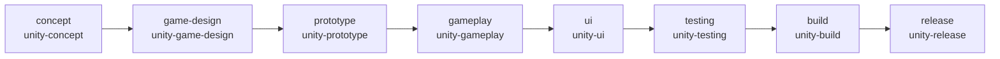

# Milestone 10 Summary — Unity Game Development Plugin

**Status:** Complete  
**Version:** 0.1.0  
**Type:** Multi-domain validation plugin

Milestone 10 delivers the Unity Game Development Plugin — the second production domain plugin. It proves Vedaws is a **Development Operating System**, not a software-only framework. All Unity-specific logic lives in `plugins/unity/`. The runtime was not modified for domain behavior (only a generic `--target` flag for plugin `build` commands).

---

## 1. Repository Tree

```
vedaws/
├── design/
│   ├── 007_PROJECT_MODEL.md      # Unity layout, template field
│   ├── 008_ARTIFACTS.md            # Unity Docs/ artifact paths
│   ├── 010_PLUGINS.md              # Unity reference plugin
│   ├── 011_SKILLS.md               # unity-* skills
│   └── README.md
│
├── docs/
│   └── MILESTONE_10_SUMMARY.md
│
├── plugins/unity/
│   ├── vedaws.plugin.toml
│   ├── unity_plugin/
│   │   ├── __init__.py             # UnityPlugin
│   │   ├── artifacts.py            # Layout + Docs artifact definitions
│   │   ├── commands.py             # vedaws unity *
│   │   └── workers.py              # unity.* placeholder workers
│   └── templates/project/
│       ├── template.toml
│       ├── workflows/unity.workflow.toml
│       └── scaffold/
│           ├── Assets/
│           ├── Packages/manifest.json
│           ├── ProjectSettings/ProjectVersion.txt
│           └── Docs/
│               ├── game-design/
│               ├── technical-design/
│               ├── builds/
│               └── playtests/
│
├── runtime/vedaws/
│   └── cli/plugin_commands.py      # generic --target for build subcommands
│
└── tests/
    └── test_unity_plugin.py
```

---

## 2. Architecture Summary

```
vedaws init unity
  ↓
discover_project_templates()     # existing generic runtime (M9)
  ↓
init_project() + apply_project_template()
  ↓
bootstrap → UnityPlugin active
  ↓
WorkflowEngine + WorkerDispatcher + EventBus   # public Plugin SDK only
```

**Domain neutrality:** The runtime never references Unity, game design, or `Docs/` paths. Template content, workers, commands, skills, health checks, and event handlers are entirely plugin-owned — the same pattern as the Software Workflow Plugin.

**Validation goal:** A second domain plugin shipped without runtime changes beyond generic infrastructure from Milestone 9.

---

## 3. Plugin Contributions

| Contribution | Implementation |
|--------------|----------------|
| Project template | `templates/project/` + `template.toml` (`id = unity`) |
| Workflow | `unity.workflow.toml` — 8-task lifecycle graph |
| Workers | `unity.design`, `unity.scene`, `unity.prefab`, `unity.script`, `unity.build`, `unity.test`, `unity.package` |
| Commands | `vedaws unity status`, `workflow`, `build`, `package` |
| Skills | `unity-csharp`, `unity-prefabs`, `unity-ui`, `unity-animation`, `unity-ai`, `unity-performance` |
| Health checks | `unity plugin`, `unity workers`, `unity project layout` |
| Event subscriptions | `TaskCompleted`, `WorkflowCompleted` |
| Configuration | `unity.workflow_id`, `unity.docs_root` |

---

## 4. Workflow Diagram



---

## 5. Task Graph

| Task | Capability | Worker(s) | Artifact focus |
|------|------------|-----------|----------------|
| concept | unity-concept | unity.design | Docs/game-design/GAME_DESIGN.md |
| game-design | unity-game-design | unity.design | Docs/game-design/GAME_DESIGN.md |
| prototype | unity-prototype | unity.scene | Docs/technical-design/TECHNICAL_DESIGN.md |
| gameplay | unity-gameplay | unity.prefab, unity.script | Docs/technical-design/TECHNICAL_DESIGN.md |
| ui | unity-ui | unity.scene | Docs/technical-design/TECHNICAL_DESIGN.md |
| testing | unity-testing | unity.test | Docs/playtests/PLAYTEST_LOG.md |
| build | unity-build | unity.build | Docs/builds/README.md |
| release | unity-release | unity.package | Docs/builds/README.md |

Run: `vedaws workflow activate unity` then `vedaws run`.

---

## 6. Example Usage

```bash
vedaws init --list-templates
vedaws init unity --name my-game
# or: vedaws init --template unity .

vedaws unity status
vedaws unity workflow
vedaws unity build --target standalone
vedaws unity package

vedaws state transition initialized
vedaws workflow activate unity
vedaws run
vedaws doctor
```

---

## 7. Future Integration Points

| Integration point | Hook | Notes |
|-------------------|------|-------|
| Unity Editor | Replace `UnityWorker.execute()` | Invoke Editor CLI or batchmode builds |
| Scene / prefab workers | `unity.scene`, `unity.prefab` | Asset pipeline automation |
| Build pipeline | `vedaws unity build` | Platform targets, CI artifacts |
| Package registry | `Packages/manifest.json` | UPM dependency management |
| Skills registry | `unity-*` skills | Bind to AI prompts for C#, UI, animation |
| Event Bus | `TaskCompleted` / `WorkflowCompleted` | Playtest automation, build notifications |
| MCP / external tools | Plugin-local adapters | Keep out of runtime core |

**Explicitly not implemented:** Unity Editor, MCP, AI providers, real build pipelines, automation.

---

## Tests

```bash
python -m pytest tests/ -q
# 88 passed
```
