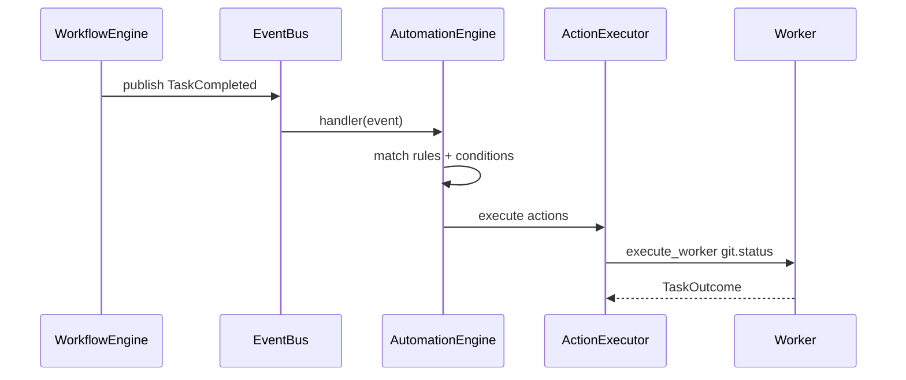

# Milestone 11 Summary — Automation Engine

**Status:** Complete  
**Version:** 0.1.0  
**Type:** Generic event-driven automation

Milestone 11 delivers a domain-neutral **Automation Engine** powered entirely by the Event Bus. Plugins contribute rules; the runtime owns execution. No software, Unity, Git, or AI logic was added to the core.

---

## 1. Repository Tree

```
vedaws/
├── design/
│   ├── 003_RUNTIME.md            # Automation in bootstrap
│   ├── 005_AUTOMATION.md         # Rule model (active)
│   ├── 010_PLUGINS.md            # contribute_automation_rule
│   └── README.md
│
├── docs/
│   └── MILESTONE_11_SUMMARY.md
│
├── plugins/software/
│   └── software_plugin/__init__.py # Example rule: implement → git.status
│
├── runtime/vedaws/
│   ├── automation/
│   │   ├── model.py                # Rule, Condition, Action
│   │   ├── loader.py               # TOML + plugin merge
│   │   ├── config.py               # enable/disable overrides
│   │   ├── registry.py
│   │   ├── conditions.py
│   │   ├── actions.py              # ActionExecutor
│   │   ├── engine.py               # EventBus subscriber
│   │   ├── validator.py            # doctor validation
│   │   └── reporter.py
│   ├── cli/automation_commands.py
│   ├── doctor/checks.py            # check_automation
│   ├── plugins/sdk.py              # contribute_automation_rule
│   ├── project/init.py             # default automation.toml
│   └── runtime/bootstrap.py        # wire AutomationEngine
│
└── tests/
    └── test_automation.py
```

---

## 2. Architecture Summary

```
EventBus.publish(event)
        ↓
AutomationEngine (subscriber)
        ↓
match on_event + if conditions
        ↓
ActionExecutor → worker | publish | state | workflow | plugin command
```

**Domain neutrality:** Rules reference generic action types and event payloads. The Software plugin's `implement → git.status` rule is plugin-owned, not runtime-owned.

---

## 3. Rule Model

```
on_event: string          # e.g. TaskCompleted
if: { key: value, ... }   # optional — all must match payload
then: [ actions... ]      # ordered execution
```

| Action | Purpose |
|--------|---------|
| `execute_worker` | Run `worker_id` (optional `task_ref`) |
| `publish_event` | Emit a new event (depth-limited) |
| `transition_state` | Project state machine transition |
| `workflow_step` | Dispatch, complete, or fail a task |
| `plugin_command` | Invoke plugin CLI handler |

---

## 4. Execution Flow



**Guards:** automation depth limit, re-entrant rule detection, doctor circular-publish analysis.

---

## 5. Example Automation Rules

### Plugin-contributed (Software)

```toml
# Equivalent data — registered via SDK
on_event = "TaskCompleted"
if task_id = "implement" AND workflow_id = "software"
then execute_worker git.status
```

### Project-local (`.vedaws/automation.toml`)

```toml
[[rules]]
id = "on-plan-complete"
on_event = "TaskCompleted"

[rules.if]
task_id = "plan"

[[rules.then]]
type = "execute_worker"
worker_id = "mock.success"
```

---

## 6. Example Usage

```bash
vedaws init software
vedaws automation list
vedaws automation disable software.implement-git-status
vedaws automation enable software.implement-git-status
vedaws automation run --rule software.implement-git-status \
  --event TaskCompleted --payload task_id=implement --payload workflow_id=software
vedaws doctor
```

---

## 7. Future AI Integration Points

| Integration point | Hook | Notes |
|-------------------|------|-------|
| AI workers | `execute_worker` action | Provider plugins register workers; rules unchanged |
| Agent triggers | `publish_event` | Custom events drive downstream rules |
| Post-task automation | `TaskCompleted` rules | Auto-run review, commit, or doc updates |
| Workflow advancement | `workflow_step` | Chain task completion to next dispatch |
| Plugin tooling | `plugin_command` | Invoke domain CLI without hardcoding in runtime |

**Explicitly not implemented:** AI, Gemini, Cursor, MCP, scheduling, background workers, distributed execution.

---

## Tests

```bash
python -m pytest tests/ -q
# 98 passed
```
