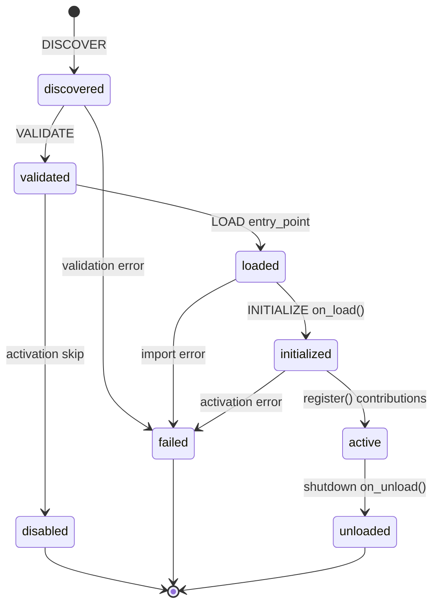

# Milestone 6 Summary — Plugin Platform

**Status:** Complete  
**Version:** 0.1.0  
**Type:** Platform milestone (no domain integrations)

Milestone 6 transforms Vedaws into an extensible platform. Plugins are first-class citizens with explicit lifecycle, manifest v1, activation, dependency resolution, SDK contributions, CLI management, and doctor validation.

---

## 1. Repository Tree

```
vedaws/
├── design/
│   ├── README.md                     # Updated layer diagram
│   └── 010_PLUGINS.md                # Full plugin platform spec (v0.2.0)
│
├── docs/
│   └── MILESTONE_6_SUMMARY.md
│
├── plugins/
│   └── hello/                        # Official reference plugin
│       ├── vedaws.plugin.toml        # Manifest v1
│       ├── hello_plugin/
│       │   ├── __init__.py           # HelloPlugin (VedawsPlugin)
│       │   └── worker.py             # hello.worker
│       └── templates/
│           └── hello.workflow.toml
│
├── runtime/vedaws/
│   ├── plugins/
│   │   ├── activation.py             # Global + project plugins.toml
│   │   ├── contributions.py          # Contribution models
│   │   ├── dependencies.py           # Dependency resolution + cycles
│   │   ├── discovery.py              # Manifest discovery
│   │   ├── lifecycle.py              # PluginStatus enum
│   │   ├── loader.py                 # entry_point import
│   │   ├── manifest.py               # Manifest v1 model
│   │   ├── manifest_parser.py        # TOML parser
│   │   ├── platform.py               # Lifecycle orchestrator
│   │   ├── registry.py               # PluginRecord + PluginRegistry
│   │   ├── reporter.py               # CLI formatting
│   │   ├── sdk.py                    # VedawsPlugin + PluginContext
│   │   ├── validation.py             # Compatibility checks
│   │   └── versioning.py             # PEP 440 constraints
│   ├── cli/commands.py               # vedaws plugins *
│   ├── doctor/checks.py              # Platform + plugin health checks
│   ├── project/init.py               # Writes .vedaws/plugins.toml
│   └── runtime/
│       ├── bootstrap.py              # PluginPlatform integration
│       └── context.py                # active_plugin_count
│
└── tests/
    ├── test_plugins.py               # Discovery + activation
    └── test_plugins_platform.py      # Lifecycle, CLI, dependencies
```

---

## 2. Architecture Summary

```
CLI (vedaws plugins *)
  ↓
RuntimeContext
  ├── PluginPlatform
  │     DISCOVER → VALIDATE → LOAD → INITIALIZE → ACTIVE
  │     ↓
  │   PluginRegistry (PluginRecord per plugin)
  │     ↓
  │   PluginContributions (aggregated)
  │     ↓
  └── WorkerRegistry ← contribute_worker()
        ↓
WorkerDispatcher → WorkflowEngine → StateEngine
```

**Activation sources (merged):**

- `~/.vedaws/plugins.toml` (global)
- `.vedaws/plugins.toml` (per-project)

**Key principles:**

- Plugins register through `PluginContext` only — no runtime modification.
- Discovery and activation are separate concerns.
- Dependency failures fail gracefully with explicit error messages.
- Built-in mock workers remain; plugin workers merge into the same registry.

---

## 3. Plugin Lifecycle Diagram



---

## 4. Public APIs

| API | Purpose |
|-----|---------|
| `VedawsPlugin` | Plugin author base class |
| `PluginContext.contribute_*` | Register workers, commands, templates, skills, health checks, config |
| `PluginManifest` | Canonical manifest v1 model |
| `PluginPlatform.bootstrap()` | Full lifecycle during runtime bootstrap |
| `PluginRegistry` | Records with status, contributions, discovery metadata |
| `discover_plugins()` | Search-path manifest discovery |
| `resolve_dependencies()` | Version + cycle validation |
| `load_activation_config()` / `merge_activation()` | Global + project activation |
| `enable_plugin()` / `disable_plugin()` | Activation file updates |

---

## 5. Example Plugin

Location: `plugins/hello/`

Demonstrates every contribution type:

| Contribution | Implementation |
|--------------|----------------|
| Worker | `hello.worker` — hello/greeting capability |
| Health check | `hello-plugin` check in doctor |
| Workflow template | `templates/hello.workflow.toml` |
| Skill | `hello.greet` |
| Command | `hello` (registered, CLI routing deferred) |
| Configuration | `hello.message` schema |

New projects created with `vedaws init` enable `hello` in `.vedaws/plugins.toml`.

---

## 6. Extension Points

Plugins may contribute (via SDK):

| Extension | Runtime effect today |
|-----------|---------------------|
| Workers | Registered in `WorkerRegistry`; dispatchable immediately |
| Health checks | Run by `vedaws doctor` |
| Workflow templates | Stored in contributions; manual install later |
| Project templates | Stored in contributions; manual install later |
| Skills | Metadata registered; execution layer deferred |
| Commands | Metadata registered; CLI routing deferred |
| Configuration | Schema registered; config merge deferred |

---

## 7. Remaining Limitations

| Item | Priority |
|------|----------|
| Plugin command CLI dispatch | High |
| Auto-install workflow/project templates | Medium |
| Configuration schema merge into `load_config` | Medium |
| Skill execution binding | Medium |
| Remote plugin registry / signed bundles | Future |
| Plugin sandboxing (`013_SECURITY.md`) | Future |
| Hot reload without restart | Low |
| Event bus plugin hooks | Deferred (Event Bus milestone) |
| Dispatch audit log | High (from 5.5 debt) |

**Non-goals confirmed (not implemented):** Gemini, Cursor, Unity, Git, Docker, Playwright, Automation, Event Bus, AI Providers.

---

## CLI

```bash
vedaws plugins              # list plugins
vedaws plugins list         # same
vedaws plugins info hello   # manifest + contributions
vedaws plugins enable hello # project activation
vedaws plugins disable hello
vedaws plugins enable hello --global  # global activation
```

---

## Tests

```bash
python -m pytest tests/ -q
# 59 passed
```

---

## Design Documents Updated

| Document | Update |
|----------|--------|
| `design/010_PLUGINS.md` | Full platform spec — lifecycle, manifest v1, SDK, activation, APIs |
| `design/README.md` | Plugin platform in layer diagram |
