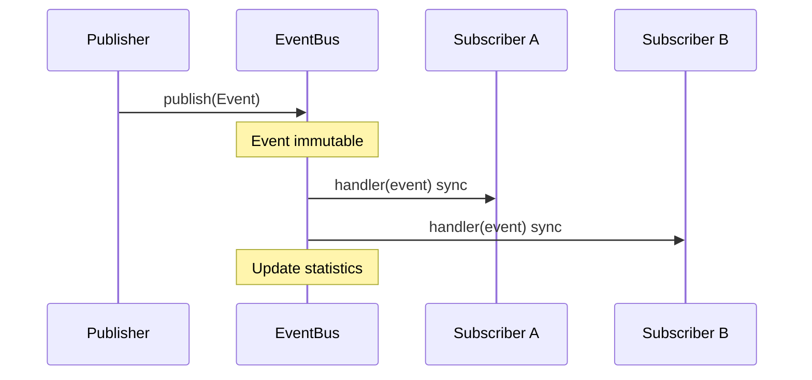

# Milestone 8 Summary — Event Bus

**Status:** Complete  
**Version:** 0.1.0  
**Type:** Platform infrastructure (in-process messaging)

Milestone 8 implements a central Event Bus as the communication backbone of Vedaws. Components publish typed, immutable events; plugins subscribe through the public SDK only.

---

## 1. Repository Tree

```
vedaws/
├── design/
│   ├── README.md                 # Event Bus in layer diagram
│   ├── 003_RUNTIME.md            # v0.2.0 — Event Bus ownership
│   └── 010_PLUGINS.md            # v0.4.0 — subscribe_event SDK
│
├── docs/
│   └── MILESTONE_8_SUMMARY.md
│
├── runtime/vedaws/
│   ├── events/
│   │   ├── model.py              # Immutable Event + create_event()
│   │   ├── types.py              # System event type constants
│   │   ├── bus.py                # EventBus (publish/subscribe/unsubscribe)
│   │   ├── integration.py        # wire_project_events, publish helpers
│   │   └── reporter.py           # vedaws events formatting
│   ├── runtime/
│   │   ├── bootstrap.py          # Creates EventBus, wires integrations
│   │   └── context.py            # event_bus, plugin_platform fields
│   ├── workflow/engine.py        # Workflow/task event publishers
│   ├── dispatch/dispatcher.py    # WorkerStarted/Completed publishers
│   ├── workers/registry.py       # WorkerRegistered publisher
│   ├── plugins/
│   │   ├── platform.py           # PluginLoaded/Unloaded + subscriptions
│   │   ├── contributions.py      # EventSubscription model
│   │   └── sdk.py                # subscribe_event()
│   ├── cli/commands.py           # vedaws events
│   └── doctor/checks.py          # check_event_bus
│
├── plugins/hello/hello_plugin/   # Example subscriber (ProjectStateChanged)
│
└── tests/
    ├── test_event_bus.py
    └── test_event_integration.py
```

---

## 2. Architecture Summary

```
Publisher (state/workflow/dispatcher/plugins)
  ↓ publish(Event)
EventBus (runtime-owned, synchronous)
  ↓ dispatch to matching subscribers
Subscriber handlers (plugin SDK subscriptions, future automation)
```

**Properties:**

- In-process only — no remote or distributed messaging
- Synchronous dispatch — handlers run inline during `publish()`
- Immutable events — `MappingProxyType` for payload/metadata
- Loose coupling — subscribers do not import publishers

---

## 3. Public APIs

| API | Package | Purpose |
|-----|---------|---------|
| `Event` | `vedaws.events` | Immutable event model |
| `create_event()` | `vedaws.events` | Factory for events |
| `EventType` | `vedaws.events` | System event type constants |
| `EventBus` | `vedaws.events` | publish / subscribe / unsubscribe / stats |
| `wire_project_events()` | `vedaws.events.integration` | Attach state + workflow publishers |
| `publish_project_initialized()` | `vedaws.events.integration` | Project init event |
| `PluginContext.subscribe_event()` | `vedaws.plugins.sdk` | Plugin-only subscription API |
| `format_event_bus_status()` | `vedaws.events.reporter` | CLI output |

Plugins **cannot** import or access `EventBus` directly.

---

## 4. Event Lifecycle Diagram



**Subscription lifecycle:**

```
subscribe(event_type, handler, subscriber_id)
  → dispatch on matching publish()
unsubscribe(subscription_id) OR plugin unload
```

Duplicate `subscriber_id` for the same event type replaces the prior subscription.

---

## 5. Example Publisher

State engine (via `wire_project_events`):

```python
event_bus.publish(
    create_event(
        EventType.PROJECT_STATE_CHANGED,
        source="state-engine",
        payload={
            "from_state": "created",
            "to_state": "initialized",
            "trigger": "human_decision",
            "reason": "Project setup complete",
        },
    )
)
```

Other publishers: `WorkflowEngine`, `WorkerDispatcher`, `WorkerRegistry`, `PluginPlatform`, `cmd_init`.

---

## 6. Example Subscriber

Hello plugin (`plugins/hello/hello_plugin/__init__.py`):

```python
context.subscribe_event(
    EventType.PROJECT_STATE_CHANGED,
    self._on_project_state_changed,
    name="state-observer",
)
```

Handler receives immutable `Event` — no bus access required.

---

## 7. System Event Types

| Event | Publisher |
|-------|-----------|
| `ProjectInitialized` | `cmd_init` / integration helper |
| `ProjectStateChanged` | State engine listener |
| `WorkflowStarted` | WorkflowEngine.activate |
| `WorkflowCompleted` | WorkflowEngine (task outcome) |
| `TaskCreated` | WorkflowEngine.activate |
| `TaskStarted` | WorkflowEngine.mark_running |
| `TaskCompleted` | WorkflowEngine (success outcome) |
| `TaskFailed` | WorkflowEngine (failure outcome) |
| `WorkerRegistered` | WorkerRegistry.register |
| `WorkerStarted` | WorkerDispatcher |
| `WorkerCompleted` | WorkerDispatcher |
| `PluginLoaded` | PluginPlatform |
| `PluginUnloaded` | PluginPlatform.unload_all |

Custom event types are supported — the type list is extensible.

---

## 8. CLI & Diagnostics

```bash
vedaws events              # types, subscriber counts, publish stats
vedaws doctor              # includes event bus health check
```

---

## 9. Remaining Limitations

| Item | Notes |
|------|-------|
| Async dispatch | Out of scope — all handlers run synchronously |
| Remote / distributed events | Out of scope — in-process only |
| Plugin publish API | Plugins subscribe only; cannot publish yet |
| Event persistence / replay | Not implemented |
| Automation rule engine | Deferred — Event Bus is prerequisite |
| correlation_id propagation | Field exists; not wired across all publishers |
| Event bus in `vedaws status` | Use `vedaws events` instead |

---

## Tests

```bash
python -m pytest tests/ -q
# 76 passed
```

---

## Non-goals (confirmed)

Automation rules, scheduling, AI providers, Unity, Git changes, remote events — **not implemented**.
