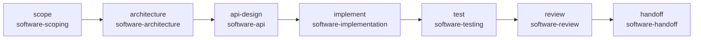

# Milestone 9 Summary — Software Workflow Plugin

**Status:** Complete  
**Version:** 0.1.0  
**Type:** First domain plugin (PAWS successor)

Milestone 9 delivers the Software Workflow Plugin — the first production domain plugin. All software-specific logic lives in `plugins/software/`. The runtime only gained generic project template discovery and application.

---

## 1. Repository Tree

```
vedaws/
├── design/
│   ├── 007_PROJECT_MODEL.md      # Template field, software layout
│   ├── 008_ARTIFACTS.md            # Artifact model + software paths
│   ├── 010_PLUGINS.md              # v0.5.0 — project templates
│   ├── 011_SKILLS.md               # Plugin-contributed skills
│   └── README.md
│
├── docs/
│   └── MILESTONE_9_SUMMARY.md
│
├── plugins/software/
│   ├── vedaws.plugin.toml
│   ├── software_plugin/
│   │   ├── __init__.py             # SoftwarePlugin
│   │   ├── artifacts.py            # Artifact definitions & status
│   │   ├── commands.py             # vedaws software *
│   │   └── workers.py              # software-* capability workers
│   └── templates/project/
│       ├── template.toml
│       ├── workflows/software.workflow.toml
│       └── scaffold/docs/
│           ├── architecture/
│           ├── api/
│           ├── decisions/
│           └── handoff/
│
├── runtime/vedaws/
│   ├── project/
│   │   ├── templates.py            # Generic template discover/apply
│   │   └── template_reporter.py
│   ├── project/init.py             # Optional template on init
│   └── cli/commands.py             # init --template, --list-templates
│
└── tests/
    └── test_software_plugin.py
```

---

## 2. Architecture Summary

```
vedaws init software
  ↓
discover_project_templates()     # scans plugins/*/templates/project/
  ↓
init_project() + apply_project_template()   # generic runtime
  ↓
bootstrap → SoftwarePlugin active
  ↓
WorkflowEngine + WorkerDispatcher + EventBus   # public APIs only
```

**Domain neutrality:** The runtime never references "software", PAWS, or artifact paths. Template content is entirely plugin-owned.

---

## 3. Plugin Contributions

| Contribution | Implementation |
|--------------|----------------|
| Project template | `templates/project/` + `template.toml` (`id = software`) |
| Workflow | `software.workflow.toml` — 7-task lifecycle graph |
| Workers | `software.scoping` … `software.handoff` (7 workers) |
| Commands | `vedaws software status\|artifacts\|workflow` |
| Skills | `software.scoping`, `software.architecture`, … `software.handoff` |
| Health checks | `software plugin`, `software workers` |
| Event subscriptions | `TaskCompleted`, `WorkflowCompleted` |
| Configuration | `software.workflow_id`, `software.artifacts_root` |

---

## 4. Default Workflow Diagram



---

## 5. Task Graph

| Task | Capability | Artifact focus |
|------|------------|----------------|
| scope | software-scoping | architecture (goals) |
| architecture | software-architecture | docs/architecture/ARCHITECTURE.md |
| api-design | software-api | docs/api/API.md |
| implement | software-implementation | docs/api/API.md |
| test | software-testing | docs/decisions/DECISIONS.md |
| review | software-review | docs/decisions/DECISIONS.md |
| handoff | software-handoff | docs/handoff/HANDOFF.md |

Run: `vedaws workflow activate software` then `vedaws run`.

---

## 6. Example Usage

```bash
vedaws init --list-templates
vedaws init software --name my-app
# or: vedaws init --template software .

vedaws software status
vedaws software artifacts
vedaws software workflow

vedaws state transition initialized
vedaws workflow activate software
vedaws run
vedaws doctor
```

---

## 7. Future AI Integration Points

| Integration point | Hook | Notes |
|-------------------|------|-------|
| Worker execution | Replace `SoftwareWorkflowWorker.execute()` | AI providers implement capabilities without runtime changes |
| Skills registry | `software.*` skills in `011_SKILLS.md` | Bind to provider prompts/tools in future milestone |
| Event Bus | `TaskStarted` / `TaskCompleted` | Automation rules can trigger AI workers |
| Artifacts | `docs/**` paths | AI outputs land in standard artifact files |
| Configuration | `software.*` schema | Provider selection, model tiers (deferred) |

**Explicitly not implemented:** Gemini, Cursor, or any AI provider.

---

## Tests

```bash
python -m pytest tests/ -q
# 82 passed
```
